# Entropy Atlas: Behavioral Stability Intelligence Platform

> **Status:** Production-Ready  
> **Type:** Core Infrastructure Service  
> **Maintainers:** Platform Engineering  

---

## 1. Executive Summary

**Entropy Atlas** is a highly specialized platform designed for *Behavioral Stability Intelligence*. Built as a real-time stream processing architecture, it ingests raw telemetry events from distributed systems and continuously quantifies the predictability of entity behavior. Rather than asking if an event is anomalous, Entropy Atlas measures how an entity's operational entropy changes over time, establishing deterministic baselines and tracking drift velocity across multiple behavioral dimensions.

Designed for Staff Engineers, Infrastructure Architects, and SREs, this platform provides the deterministic intelligence required to understand system decay, uncoordinated behavioral shifts, and emergent instability before they manifest as critical incidents.

---

## 2. Problem Statement

Modern distributed systems (microservices, payment gateways, complex APIs) generate vast amounts of telemetry. As these systems scale, the behavioral patterns of their constituent entities (users, services, regions, devices) naturally evolve. 

The fundamental problem is **silent degradation of predictability**. An API client might not trigger an error threshold, but its request patterns might become highly chaotic. A microservice might maintain a 99.9% success rate, but its resource affinity and timing variance might suddenly drift. 

Engineers lack a deterministic, continuous measure of *behavioral stability*. They cannot answer:
* "Is this service behaving more erratically today than it was a week ago?"
* "What specific behavioral dimensions are contributing to this instability?"
* "Is the system as a whole trending toward chaos?"

---

## 3. Why Traditional Monitoring Fails

* **Threshold-Based Alerts:** Focus on point-in-time failures (e.g., CPU > 90%, Error Rate > 5%). They ignore the structural predictability of the operations leading up to the failure.
* **Anomaly Detection (ML):** Often a black box that suffers from high false-positive rates. It identifies outliers but fails to explain *structural drift* over a sustained period.
* **Log Aggregation:** Requires manual querying and hypothesis generation. It is reactive, not continuous or intelligent.
* **Distributed Tracing:** Shows the *how* and *where* of a single request, but cannot compute the macro-level behavioral stability of the entity initiating those requests.

---

## 4. Business Motivation

For enterprise platforms (e.g., payment networks, high-throughput data planes), operational predictability is synonymous with reliability.

* **Proactive Risk Mitigation:** By detecting increasing entropy and drift velocity early, teams can intervene before behavioral instability cascades into system failure.
* **Objective Deployment Validation:** When a new service version is deployed, stability scores provide an immediate, objective measure of whether the new code introduced behavioral chaos.
* **Automated Forensic Reconstruction:** The ability to replay and reconstruct behavioral timelines reduces Mean Time to Resolution (MTTR) by providing deterministic explanations for instability.

---

## 5. What Is Behavioral Stability Intelligence

Behavioral Stability Intelligence is the continuous, deterministic measurement of an entity's operational predictability. 

It involves decomposing raw event streams into distinct behavioral dimensions (Timing, Location, Resource Affinity, Action Diversity) and applying mathematical models (Shannon entropy approximations) to quantify chaos.

Key metrics computed by the platform:
* **Behavioral Stability Score (0-100):** How predictable the entity is.
* **Instability Index (0-100):** The inverse of stability; the magnitude of chaos.
* **Entropy Growth:** The directional trajectory of the entity's entropy.
* **Drift Velocity:** The rate at which the entity's behavior is deviating from its historical baseline.
* **Volatility Trends:** Categorical classifications (Stable, Increasing, High) of behavioral state.

---

## 6. Core Features

* **Multi-Dimensional Entropy Decomposition:** Analyzes behavior across discrete vectors.
* **Continuous Drift Attribution:** Automatically explains *why* an entity's stability score changed.
* **Real-Time Stream Processing:** Built on Kafka Streams for sub-second intelligence.
* **Forensic Replay Engine:** Reconstructs and validates historical stability states.
* **Behavior DNA Fingerprinting:** Generates unique complexity signatures for entities.
* **Global Stability Tracking:** Aggregates individual entity stability into a system-wide health metric.

---

## 7. Platform Screenshots

### Command Center
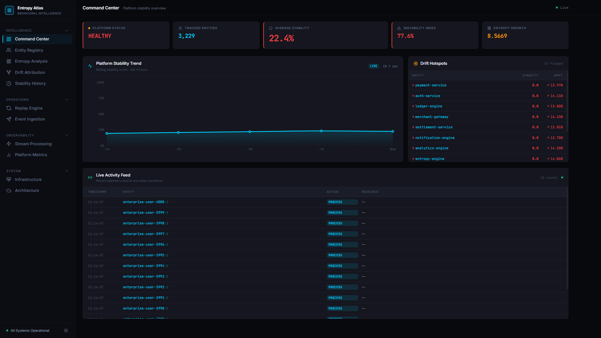
*Centralized operational intelligence showing global stability, instability indices, and live drift hotspots.*

### Entity Registry
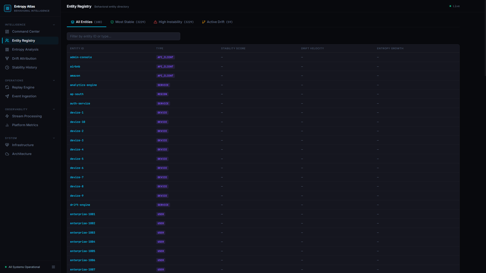
*Directory of all tracked entities with their real-time stability scores and drift velocities.*

### Entity Investigation
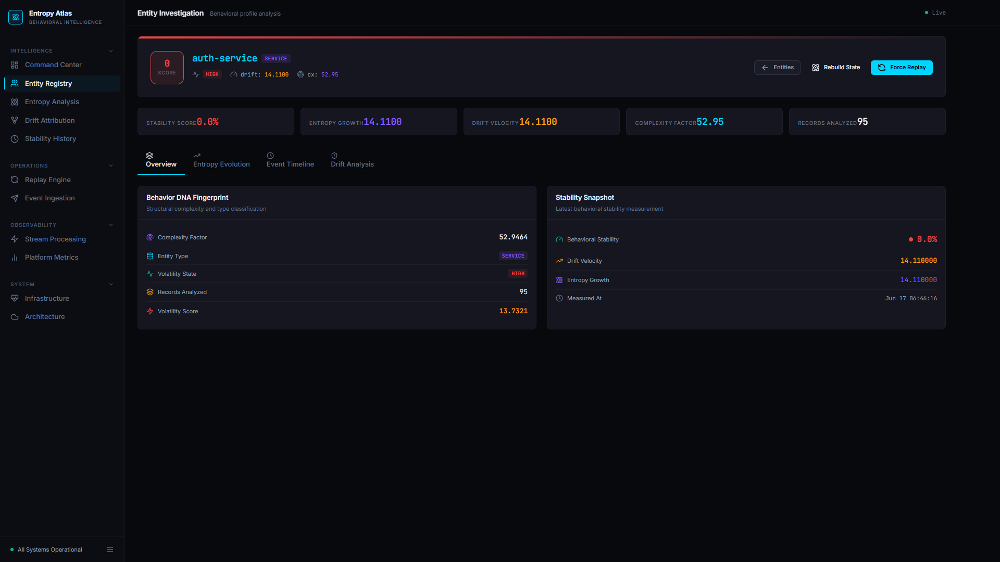
*Deep-dive profiling of a single entity, showcasing its Behavior DNA and real-time stability snapshot.*

### Behavioral Event Timeline
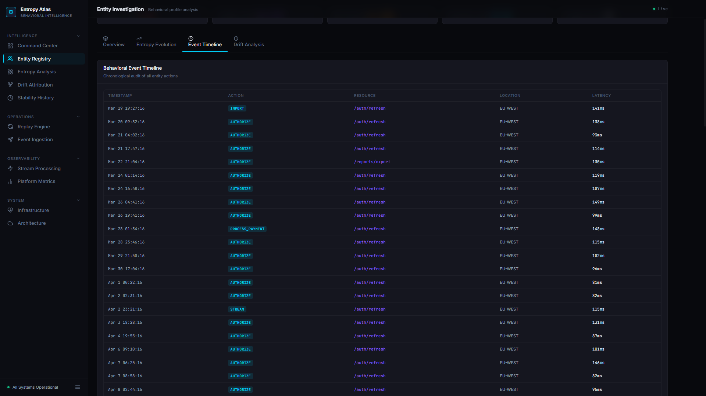
*Chronological audit log of all events driving the entity's behavioral intelligence.*

### Event Investigation
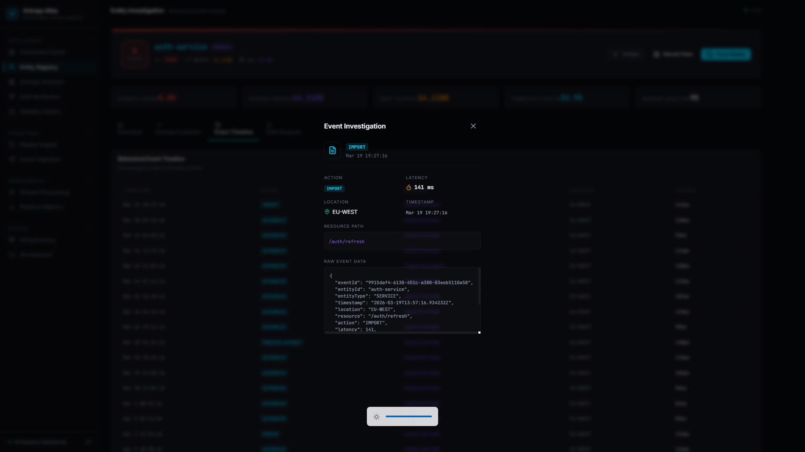
*Granular inspection of raw event payload and associated metadata.*

### Entropy Analysis
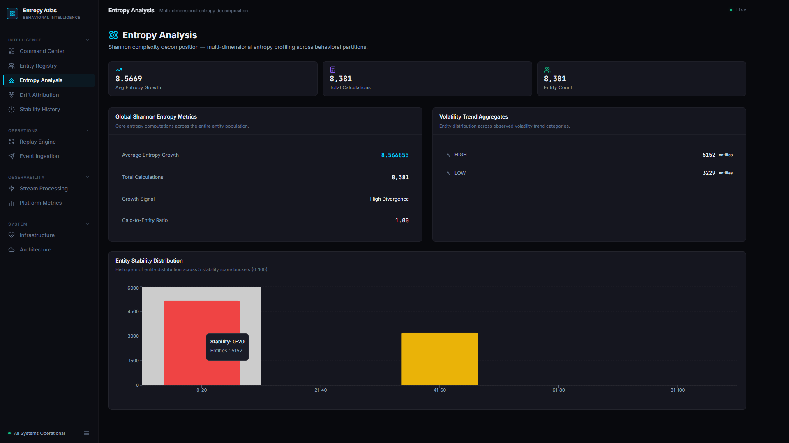
*Global distribution and decomposition of Shannon entropy metrics across the platform.*

### Entropy Evolution
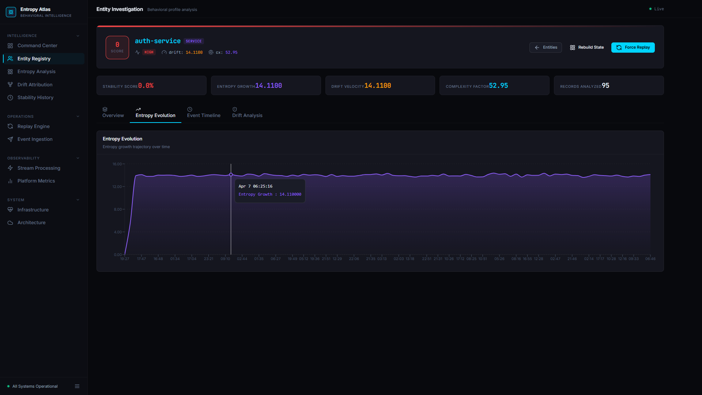
*Trajectory visualization of how an entity's entropy has grown or stabilized over time.*

### Drift Attribution Studio
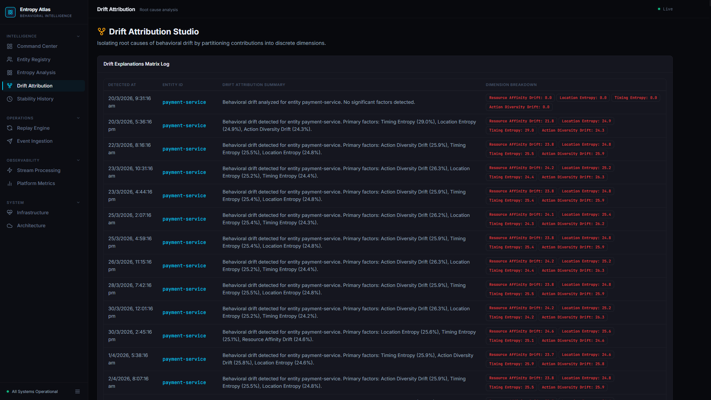
*Root-cause analysis engine partitioning drift contributions into discrete dimensions (Timing, Location, Resource, Action).*

### Active Drift Entities
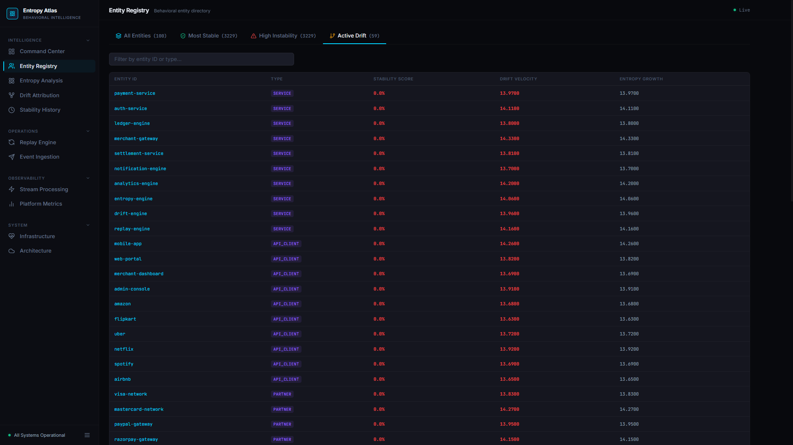
*Real-time feed of entities currently experiencing high behavioral drift.*

### Stability Timeline
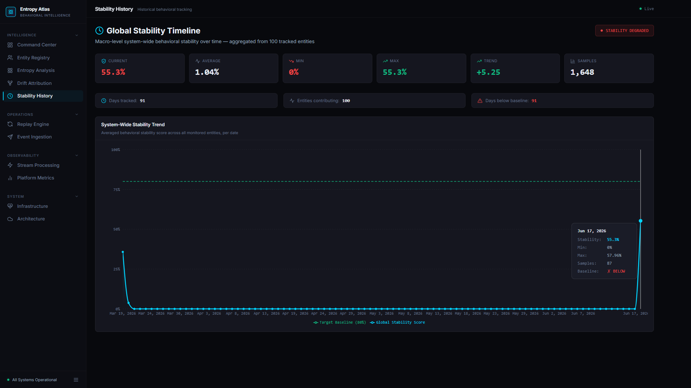
*Macro-level system-wide behavioral stability tracked over extensive time horizons.*

### Replay Intelligence Engine
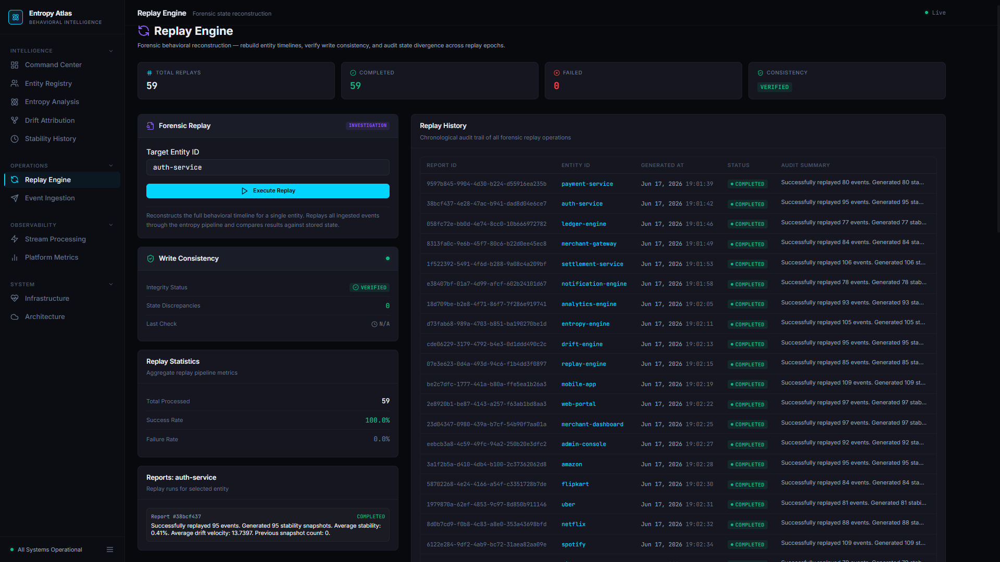
*Forensic state reconstruction interface to rebuild timelines and audit state divergence.*

### Stream Processing Intelligence
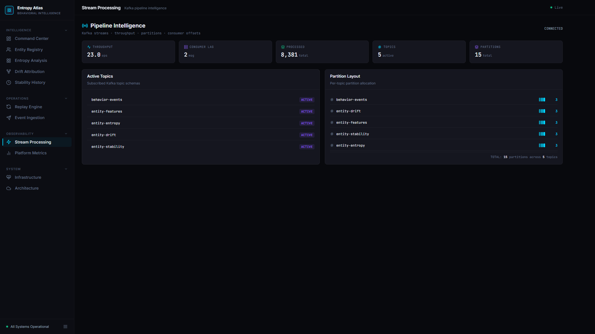
*Live telemetry from the Kafka Streams pipeline, showing throughput, lag, and partition allocation.*

### Platform Observability
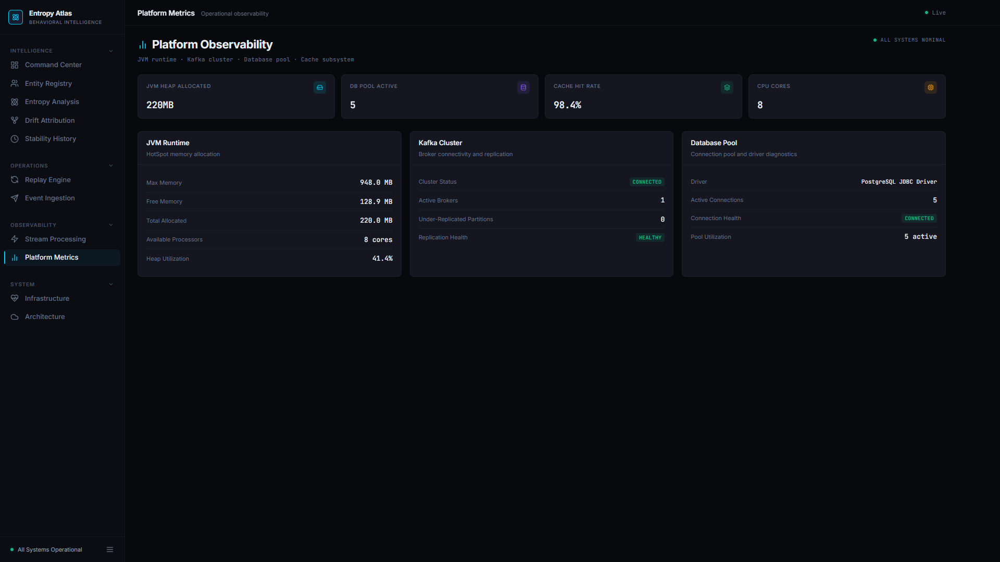
*JVM, connection pool, and core infrastructure health metrics.*

### Infrastructure Intelligence
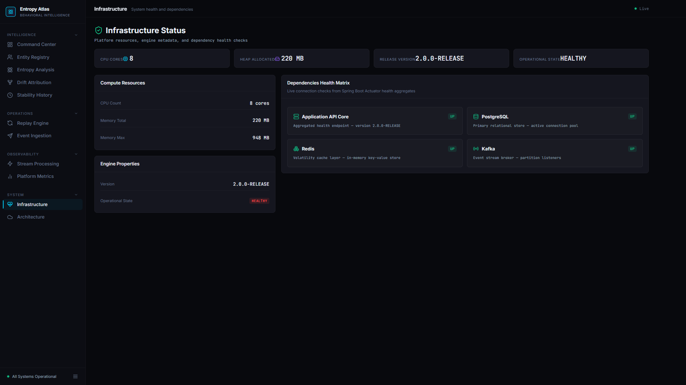
*Health matrix of all backend dependencies (Kafka, Redis, PostgreSQL).*

### System Topology
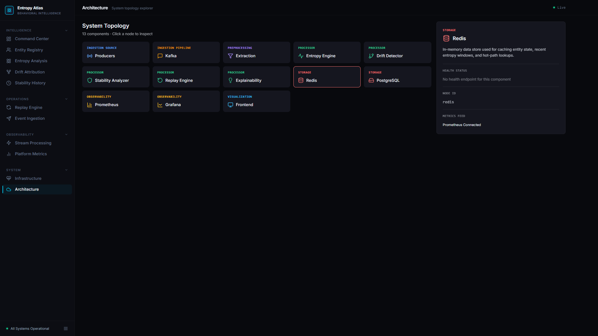
*Interactive architectural map of the Entropy Atlas components.*

### Telemetry Event Ingestion
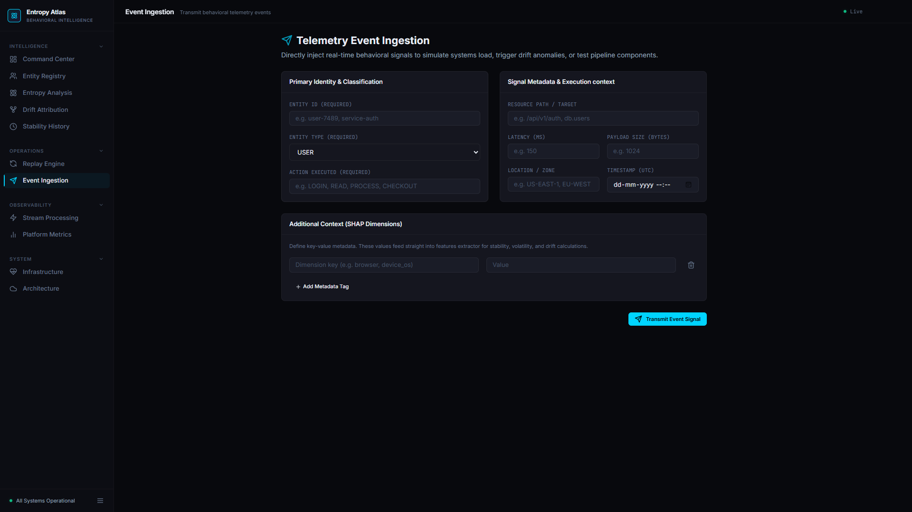
*Direct injection interface for simulating load and triggering drift anomalies.*

---

## 8. System Architecture

Entropy Atlas uses a highly decoupled, event-driven topology optimized for write-heavy streaming analytics.

```text
+-------------------+      +-------------------+      +-------------------------+
|                   |      |                   |      |                         |
|  Event Producers  |=====>|    Kafka Topic    |=====>|  Kafka Streams Engine   |
|  (Microservices,  |      | [behavior-events] |      | (Behavioral Pipeline)   |
|   API Gateways)   |      |                   |      |                         |
+-------------------+      +-------------------+      +-------------------------+
                                                              |
                                                              v
+-------------------------+      +-------------------+      +-------------------------+
|                         |      |                   |      |                         |
|   Spring Boot Backend   |<=====|    Kafka Topics   |<=====|     Core Engines:       |
|   (REST API, Admin,     |      |  [entity-drift,   |      | - Feature Extraction    |
|    Replay Orchestrator) |      | entity-stability] |      | - Entropy Calculation   |
|                         |      |                   |      | - Drift Analysis        |
+-------------------------+      +-------------------+      | - Stability Scoring     |
     |            |                                         +-------------------------+
     v            v
+----------+ +-----------+
|          | |           |
| Postgres | |   Redis   |
| (Storage)| |  (Cache)  |
+----------+ +-----------+
     |
     v
+-------------------------+
|                         |
|   React + Vite SPA      |
|  (Mission Control UI)   |
|                         |
+-------------------------+
```

---

## 9. Technology Stack

**Backend:**
* **Java 21:** Utilizing modern language features (Records, Virtual Threads).
* **Spring Boot 3.x:** Core application framework.
* **Kafka Streams:** Stateful stream processing topology.
* **PostgreSQL:** Persistent system of record.
* **Redis:** High-speed in-memory state store and caching layer.
* **Micrometer / Prometheus:** JVM and pipeline observability.

**Frontend:**
* **React 18:** Component-based UI.
* **Vite:** High-performance build tool.
* **Recharts:** Complex data visualization.
* **Tailwind CSS:** Utility-first styling framework.

---

## 10. Project Structure

```text
Entropy-Atlas/
│   docker-compose.yml          # Multi-container orchestration
│   README.md                   # Project documentation
│
├── backend
│   │   Dockerfile              # Spring Boot container image
│   │   pom.xml                 # Maven dependencies
│   │
│   └── src
│       └── main
│           ├── java
│           │   └── com
│           │       └── entropyatlas
│           │           └── entropyatlas
│           │               │   EntropyAtlasApplication.java
│           │               │
│           │               ├── api          # Controllers, DTOs, Filters (REST Layer)
│           │               │   ├── controllers
│           │               │   │       AdminController.java
│           │               │   │       AnalyticsController.java
│           │               │   │       DashboardController.java
│           │               │   │       EntityController.java
│           │               │   │       EntityIntelligenceController.java
│           │               │   │       EventController.java
│           │               │   │       PlatformMetricsController.java
│           │               │   │       ReplayIntelligenceController.java
│           │               │   │       StreamController.java
│           │               │   │       SystemController.java
│           │               │   │
│           │               │   ├── dto
│           │               │   │       BehaviorEventRequest.java
│           │               │   │       BehaviorEventResponse.java
│           │               │   │       DriftExplanationResponse.java
│           │               │   │       EntityResponse.java
│           │               │   │       ReplayReportResponse.java
│           │               │   │       StabilitySnapshotResponse.java
│           │               │   │
│           │               │   └── filters
│           │               │           CorrelationIdFilter.java
│           │               │
│           │               ├── config       # Kafka, Redis, OpenAPI configurations
│           │               │       KafkaConfig.java
│           │               │       OpenApiConfig.java
│           │               │       RedisConfig.java
│           │               │
│           │               ├── domain       # JPA Entities
│           │               │       BehaviorEvent.java
│           │               │       DriftExplanation.java
│           │               │       Entity.java
│           │               │       ReplayReport.java
│           │               │       StabilitySnapshot.java
│           │               │
│           │               ├── exceptions   # Global exception handling
│           │               │       ResourceNotFoundException.java
│           │               │
│           │               ├── repositories # Spring Data JPA Repositories
│           │               │       BehaviorEventRepository.java
│           │               │       DriftExplanationRepository.java
│           │               │       EntityRepository.java
│           │               │       ReplayReportRepository.java
│           │               │       StabilitySnapshotRepository.java
│           │               │
│           │               ├── services     # Core Business Logic (Engines)
│           │               │       BehavioralIntelligencePipeline.java
│           │               │       DriftAnalysisService.java
│           │               │       EntropyCalculationService.java
│           │               │       EventIngestionService.java
│           │               │       ExplainabilityService.java
│           │               │       FeatureExtractionService.java
│           │               │       MetricsService.java
│           │               │       ReplayEngineService.java
│           │               │       StabilityScoringService.java
│           │               │
│           │               ├── streams      # Kafka Streams Topology Definition
│           │               │       KafkaStreamsTopology.java
│           │               │
│           │               └── tools        # Data Generators
│           │                       EntropyAtlasDataGenerator.java
│           │
│           └── resources
│                   application.yml
│                   logback-spring.xml
│
├── frontend
│   │   Dockerfile
│   │   index.html
│   │   nginx.conf
│   │   package-lock.json
│   │   package.json
│   │   postcss.config.js
│   │   tailwind.config.js
│   │   vite.config.js
│   │
│   └── src
│       │   App.jsx
│       │   index.css
│       │   main.jsx
│       │
│       ├── api          # Axios instance and React Hooks
│       │       axiosInstance.js
│       │       hooks.js
│       │
│       ├── components   # Reusable UI components (Cards, Tables, Modals)
│       │       Button.jsx
│       │       Card.jsx
│       │       ChartContainer.jsx
│       │       Input.jsx
│       │       Layout.jsx
│       │       Modal.jsx
│       │       Pagination.jsx
│       │       Select.jsx
│       │       Table.jsx
│       │
│       ├── constants
│       │       index.js
│       │
│       ├── pages        # Route Components
│       │       Architecture.jsx
│       │       Dashboard.jsx
│       │       DriftAttribution.jsx
│       │       Entities.jsx
│       │       EntityProfile.jsx
│       │       EntropyExplorer.jsx
│       │       EventIngestion.jsx
│       │       MetricsCenter.jsx
│       │       ReplayCenter.jsx
│       │       StabilityTimeline.jsx
│       │       StreamAnalytics.jsx
│       │       SystemHealth.jsx
│       │
│       └── utils        # Helper functions
│               index.js
│
├── grafana
│   └── provisioning
│       ├── dashboards
│       │       dashboard.yml
│       │       entropy-atlas-dashboard.json
│       │
│       └── datasources
│               datasource.yml
│
├── images
│       active-drift-entity.png
│       behavioral-entity-directory.png
│       behavioral-event-timeline.png
│       behavioral-profile-analysis.png
│       drift-analysis.png
│       drift-attribution-studio.png
│       entropy-growth-trajectory.png
│       event-investigation.png
│       global-stability-timeline.png
│       infrastructure.png
│       multi-dimensional-entropy-decomposition.png
│       platform-metrics.png
│       platform-stability-overview.png
│       replay-engine.png
│       stream-processing.png
│       system-topology.png
│       telemetry-event-ingestion.png
│
└── prometheus
        prometheus.yml
```

---

## 11. Domain Model

* **`Entity`**: The root aggregate representing an actor (e.g., `payment-service`, `user-123`).
* **`BehaviorEvent`**: An immutable, atomic record of an action performed by an entity (e.g., `LOGIN`, `PROCESS_PAYMENT`).
* **`StabilitySnapshot`**: A point-in-time materialization of an entity's behavioral stability metrics.
* **`DriftExplanation`**: A detailed breakdown of the dimensional contributions that caused a drift event.
* **`ReplayReport`**: An audit record of a forensic timeline reconstruction.

---

## 12. Database Design

* **`entities`**: Stores entity metadata, type, and creation timestamps.
* **`behavior_events`**: Append-only log of all ingested telemetry. Optimized with indexes on `entity_id` and `timestamp`.
* **`stability_snapshots`**: Timeseries table capturing `stability_score`, `entropy_growth`, and `drift_velocity`.
* **`drift_explanations`**: Stores the root cause analysis summaries.
* **`drift_explanation_contributions`**: Normalized child table mapping explanations to specific dimensional percentages (e.g., Timing: 45%).
* **`replay_reports`**: Stores metadata regarding admin-triggered historical replays.

---

## 13. Behavioral Event Lifecycle

```text
[1. INGESTION] -> [2. STORAGE] -> [3. KAFKA] -> [4. STREAM PROCESSING] -> [5. MATERIALIZATION]

1. Client POSTs to /api/v1/events
2. EventIngestionService saves raw event to PostgreSQL (behavior_events).
3. EventIngestionService publishes message to Kafka topic 'behavior-events'.
4. Kafka Streams consumes event, runs through Behavioral Intelligence Pipeline.
5. Emits to 'entity-stability' topic -> consumed by Spring -> saved as StabilitySnapshot -> cached in Redis.
```

---

## 14. Behavioral Intelligence Pipeline

The pipeline is a sequential chain of deterministic engines implemented via `BehavioralIntelligencePipeline` service and orchestrated by Kafka Streams.

**Why it exists:** To transform raw, meaningless telemetry into structured mathematical models of behavior.
**Where it appears in UI:** Powers the entirety of the platform, specifically the Entity Profile and Command Center.

---

## 15. Entropy Engine

**Why it exists:** To mathematically quantify the chaos or unpredictability of an entity's actions.
**How it works:** Implemented in `EntropyCalculationService`. It uses deterministic approximations of Shannon complexity across four vectors:
1. **Timing Entropy:** Based on the hour of day and day of week.
2. **Location Entropy:** Derived from the geographic or network location hash.
3. **Resource Entropy:** Derived from the API or database resource accessed.
4. **Action Entropy:** Derived from the type of operation (e.g., read, write).
These are smoothed using an Exponential Moving Average (EMA) ($\alpha = 0.15$) against historical state.

---

## 16. Stability Engine

**Why it exists:** Raw entropy is difficult to interpret. We need a normalized 0-100 metric for operational dashboards.
**How it works:** Implemented in `StabilityScoringService`. It aggregates the multi-dimensional entropy scores and current drift velocity. Higher entropy and higher drift result in a lower stability score.
* Stability Score = 100 - Instability Index.
**Where it appears in UI:** Command Center hero metric, Entity Registry table.

---

## 17. Drift Attribution Engine

**Why it exists:** When stability drops, engineers need to know *why* without digging through logs.
**How it works:** Implemented in `DriftAnalysisService`. It calculates the absolute delta between current entropy dimensions and the previous baseline (drift velocity). The `generateDriftExplanation` method creates a normalized percentage breakdown (e.g., "Timing Entropy contributed 60% to this drift").
**Where it appears in UI:** Drift Attribution Studio.

---

## 18. Volatility Engine

**Why it exists:** To categorize the rate of change into human-readable states for alerting and triage.
**How it works:** Analyzes the magnitude and trajectory of the drift velocity. Classifies the entity as `STABLE`, `ELEVATED`, or `HIGH` volatility.
**Where it appears in UI:** Entity Investigation header badges.

---

## 19. Behavior DNA Engine

**Why it exists:** To fingerprint the structural complexity of an entity.
**How it works:** Aggregates long-term stability baselines, average entropy, and standard deviation of drift into a single "Complexity Factor".
**Where it appears in UI:** Entity Investigation > Overview Tab (Behavior DNA Fingerprint card).

---

## 20. Replay Intelligence Engine

**Why it exists:** For forensic auditing. If an algorithm changes or state is lost, the platform must deterministically rebuild the intelligence from raw events.
**How it works:** Implemented in `ReplayEngineService`. It loads all historical `BehaviorEvent`s from Postgres for a specific entity, sorts them by timestamp, and forces them synchronously through the `BehavioralIntelligencePipeline`. It then compares the resulting final state against the current stored state to verify consistency.
**Where it appears in UI:** Replay Engine module.

```text
[Admin Request] -> Fetch All Entity Events -> Replay via Pipeline -> Generate Stability Snapshots -> Compare & Save ReplayReport
```

---

## 21. Kafka Streams Processing Pipeline

**Why it exists:** To provide scalable, fault-tolerant, stateful stream processing.
**How it works:** Defined in `KafkaStreamsTopology.java`.
* Subscribes to `behavior-events`.
* Uses `KStream.mapValues` to pass events to the Feature Extractor -> Entropy Engine -> Drift Engine -> Stability Engine.
* Branches the stream into `entity-drift` and `entity-stability` output topics based on calculated metrics.

---

## 22. Observability Architecture

**Why it exists:** The intelligence platform itself must be observable to guarantee accuracy.
**How it works:**
* Spring Boot Actuator exposes `/actuator/prometheus`.
* `MetricsService` registers custom Micrometer counters (`events_ingested_total`, `entropy_calculations_total`, `drift_detections_total`).
* Grafana consumes Prometheus data to visualize JVM heap, Kafka consumer lag, and database connection pools.

---

## 23. Frontend Platform Overview

The frontend is a React + Vite Single Page Application (SPA). It uses a dark, futuristic design language to convey deep operational intelligence. It relies heavily on `react-router-dom` for navigation, `recharts` for complex SVG data visualizations, and customized Tailwind CSS for layout density and typography. 

---

## 24. Dashboard Modules

* **Architecture:** Renders an interactive D3/SVG-style node graph of the system components.
* **Entities:** A robust data grid for filtering and sorting the entity registry.
* **EntropyExplorer:** Advanced multi-dimensional visualization of entropy evolution.
* **EventIngestion:** A developer tool to manually POST telemetry payloads.
* **MetricsCenter:** Real-time polling of backend Actuator and Micrometer metrics.

---

## 25. API Reference

The backend exposes a comprehensive REST surface.

### Admin
* `GET /admin/drift-report/{entityId}`: Retrieves deep diagnostic drift reports.
* `POST /admin/rebuild/{entityId}`: Triggers asynchronous state rebuild.
* `GET /admin/replay-reports/{entityId}`: Fetches forensic replay history.
* `POST /admin/replay/{entityId}`: Executes a deterministic replay sequence.

### Analytics
* `GET /api/v1/analytics/distribution`: Global stability score distribution.
* `GET /api/v1/analytics/drift`: Platform-wide drift statistics.
* `GET /api/v1/analytics/entropy`: Aggregated Shannon entropy metrics.
* `GET /api/v1/analytics/trends`: Macro volatility trends.
* `GET /api/v1/analytics/volatility`: Aggregate volatility categories.

### Dashboard
* `GET /api/v1/dashboard/activity`: Live feed of recent behavior events.
* `GET /api/v1/dashboard/health`: High-level system health overview.
* `GET /api/v1/dashboard/overview`: Core command center KPIs.

### Entity Management
* `GET /api/v1/entities`: Paginated registry list.
* `GET /api/v1/entities/{id}`: Core profile lookup.
* `GET /api/v1/entities/{id}/explanations`: Dimensional drift summaries.
* `GET /api/v1/entities/{id}/stability`: Timeseries stability data.
* `GET /api/v1/entities/{id}/timeline`: Chronological event audit log.

### Entity Intelligence
* `GET /api/v1/entities/{id}/behavior-dna`: Complexity fingerprinting.
* `GET /api/v1/entities/{id}/entropy-evolution`: Multi-dimensional entropy timeseries.
* `GET /api/v1/entities/{id}/volatility`: Current volatility classification.
* `GET /api/v1/entities/high-drift`: Entities exceeding drift thresholds.
* `GET /api/v1/entities/top-stable`: Entities with lowest entropy.
* `GET /api/v1/entities/top-unstable`: Entities with highest chaos indices.

### Event Ingestion
* `POST /api/v1/events`: Fire-and-forget telemetry ingestion endpoint.

### Platform Metrics
* `GET /api/v1/metrics/cache`: Redis hit rates and utilization.
* `GET /api/v1/metrics/database`: Postgres connection pool states.
* `GET /api/v1/metrics/jvm`: Heap, threads, and GC metrics.
* `GET /api/v1/metrics/kafka`: Consumer lag and partition health.
* `GET /api/v1/metrics/summary`: Consolidated infrastructure health.

### Replay Intelligence
* `GET /api/v1/replay/consistency`: Verification results of stored vs. calculated state.
* `GET /api/v1/replay/history`: Log of all historical replay operations.
* `GET /api/v1/replay/statistics`: Success/Failure rates of replay engine.

### Streams
* `GET /api/v1/streams/lag`: Consumer group lag metrics.
* `GET /api/v1/streams/partitions`: Topic partition allocation mapping.
* `GET /api/v1/streams/throughput`: Processing velocity (msg/sec).
* `GET /api/v1/streams/topics`: Active Kafka topic metadata.

### System
* `GET /api/v1/system/dependencies`: Health checks for downstream dependencies.
* `GET /api/v1/system/health`: Global operational state.
* `GET /api/v1/system/resources`: CPU and memory utilization.
* `GET /api/v1/system/status`: Application release and uptime data.

---

## 26. End-to-End Validation Workflow

To validate the platform operates correctly:
1. Ensure `docker-compose up` shows all containers healthy.
2. Navigate to the `Event Ingestion` UI module.
3. Inject 5 events for a new entity ID (e.g., `test-service-01`).
4. Navigate to `Entity Registry` to verify the entity was created and a baseline stability score is present.
5. Rapidly inject 20 more events for the same entity with wildly varying locations and latencies.
6. Observe the Entity Profile: Entropy Growth should spike, Drift Velocity should increase, and the Volatility State should transition to `HIGH`.

---

## 27. Swagger Validation Guide

The OpenAPI specification is available at `http://localhost:8080/swagger-ui.html`. 
Engineers can bypass the UI and validate the API contracts directly using Swagger.
* Test `POST /api/v1/events` to ensure validation rules (e.g., missing entityId) throw `400 Bad Request`.
* Test `GET /api/v1/entities/{id}/behavior-dna` to verify the mathematical shape of the JSON response.

---

## 28. Platform Metrics Guide

Validation of backend health:
1. Open Grafana (`http://localhost:3001`).
2. View the pre-provisioned "Entropy Atlas Backend Overview" dashboard.
3. Run a load test script pushing 100 events/second.
4. Verify `events_ingested_total` rises linearly and `entropy_calculations_total` matches exactly.
5. Verify JVM heap does not exhibit rapid saw-tooth patterns indicative of memory leaks in the stream processors.

---

## 29. Replay Validation Guide

To validate the deterministic nature of the intelligence pipeline:
1. Identify a highly volatile entity in the UI.
2. Navigate to the **Replay Engine**.
3. Execute a replay for that entity ID.
4. The system will process all historical events synchronously.
5. Ensure the resulting `ReplayReport` shows a status of `COMPLETED` and `Write Consistency` is marked as `VERIFIED`.

---

## 30. Operational Workflow

For SREs managing Entropy Atlas in production:
* **Cold Start:** Kafka topics are automatically created on startup via Spring Kafka configuration.
* **Monitoring:** Alarms should be set on Kafka consumer lag (`/api/v1/streams/lag`). If lag increases exponentially, the Kafka Streams instances require horizontal scaling.
* **Data Retention:** `behavior_events` will grow unbounded. Implement table partitioning in PostgreSQL based on the `timestamp` column.

---

## 31. Scalability Considerations

* **Stream Processing:** Kafka Streams instances can be scaled horizontally by deploying more backend containers. Kafka handles partition reassignment automatically. Max concurrency is limited by the number of partitions on the `behavior-events` topic.
* **Database:** The `behavior_events` table handles massive insert velocity. In highly-scaled environments, this should be transitioned to a columnar datastore (e.g., ClickHouse) or partitioned deeply.
* **Cache:** Redis prevents massive query loads on PostgreSQL for current stability state. Ensure Redis is provisioned with sufficient memory and eviction policies (e.g., `allkeys-lru`).

---

## 32. Engineering Tradeoffs

* **Eventual Consistency vs. Real-Time UI:** The REST API reads from PostgreSQL/Redis, which are updated *after* Kafka Streams processing. There is a sub-second delay between event ingestion and metric updates. This is a tradeoff made for massive write throughput.
* **Deterministic Math vs. Machine Learning:** We utilize deterministic Shannon entropy models rather than deep learning. While less capable of finding complex hidden correlations, it is 100% explainable, requires zero training time, and uses fractions of the compute resources.
* **Monolithic Repository:** The backend currently houses both the REST API and the Kafka Streams topology in a single Spring Boot application. At massive scale, the streams topology should be extracted into a dedicated microservice.

---

## 33. Engineering Concepts Demonstrated

* **Event Sourcing & CQRS:** State is derived entirely from an immutable event log.
* **Real-Time Stream Processing:** Utilizing Kafka Streams for complex event topology and state stores.
* **Deterministic Algorithms:** Replacing black-box ML with mathematically explainable chaos equations.
* **High-Density Operational UI:** Moving beyond standard charting to create deep, interactive investigation workspaces.

---

## 34. Future Improvements

* **ClickHouse Integration:** Migrate raw event storage from PostgreSQL to ClickHouse for superior timeseries aggregation performance.
* **Dynamic Baselining:** Allow the EMA $\alpha$ coefficient to self-tune based on entity lifecycle phase.
* **WebSockets/SSE:** Push stability updates directly to the frontend to eliminate client-side polling.
* **Topology Extraction:** Separate the REST API, Ingestion, and Streams Processing into isolated deployable units.

---

## 35. License

Copyright © 2026. All rights reserved.
Internal Platform Engineering Documentation. Not for external distribution.
