# Entropy Atlas: Behavioral Stability Intelligence Platform

> **Type:** Core Infrastructure Service

---

## 1. Executive Summary

**Entropy Atlas** is a highly specialized platform designed for *Behavioral Stability Intelligence*. Built as a real-time stream processing architecture, it ingests raw telemetry events from distributed systems and continuously quantifies the predictability of entity behavior. Rather than asking if an event is anomalous, Entropy Atlas measures how an entity's operational entropy changes over time, establishing deterministic baselines and tracking drift velocity across multiple behavioral dimensions.

Designed for Staff Engineers, Infrastructure Architects, and SREs, this platform provides the deterministic intelligence required to understand system decay, uncoordinated behavioral shifts, and emergent instability before they manifest as critical incidents.

The platform has now been extended with an **AI Risk Manager** for defensive payment-risk operations. This extension applies the existing behavioral intelligence foundation to payment events, enabling risk detection, risk scoring, AI verification and fallback, high-risk alerting, incident investigation, explainability evidence, bounded defensive decisions, and a complete audit trail. The risk workflow is complemented by evaluation metrics, held-out classification analysis, scenario simulation, and risk replay capabilities.

The resulting system combines **behavioral stability intelligence with an auditable AI-powered payment-risk workflow**, allowing risk signals to move from event ingestion through detection, verification, investigation, decisioning, and evaluation while maintaining explicit operational controls and traceability.

---
## 2. Problem Statement

Modern distributed systems (microservices, payment gateways, complex APIs) generate vast amounts of telemetry. As these systems scale, the behavioral patterns of their constituent entities (users, services, regions, devices) naturally evolve.

The fundamental problem is **silent degradation of predictability**. An API client might not trigger an error threshold, but its request patterns might become highly chaotic. A microservice might maintain a 99.9% success rate, but its resource affinity and timing variance might suddenly drift.

Engineers lack a deterministic, continuous measure of *behavioral stability*. They cannot answer:
* "Is this service behaving more erratically today than it was a week ago?"
* "What specific behavioral dimensions are contributing to this instability?"
* "Is the system as a whole trending toward chaos?"

### The Payment Risk Problem

Payment systems introduce a second, high-impact problem: **behavioral changes can become financial risk before they become conventional system failures**.

A payment event can be technically valid while its behavioral context indicates potential abuse. Rapid transaction velocity, unusual transaction amounts, geographic inconsistency, device changes, payment-method shifts, repeated authentication failures, and coordinated activity across entities can all represent meaningful risk signals.

Traditional rule-based monitoring can identify individual conditions, but it does not provide a complete operational workflow for moving from a detected risk signal to a verified, explainable, and auditable response.

The AI Risk Manager extension addresses this gap by applying behavioral intelligence to payment-risk operations. It provides a bounded workflow for:

* ingesting payment-risk events
* detecting and scoring potentially risky behavior
* applying AI verification with controlled fallback paths
* generating actionable risk alerts
* investigating individual risk incidents
* presenting evidence and explanations for risk decisions
* executing bounded defensive decisions
* maintaining an auditable record of the complete workflow
* evaluating detection performance using held-out classification metrics
* replaying and simulating risk scenarios for validation

This creates a unified problem space where **behavioral stability intelligence identifies meaningful changes in entity behavior, while the AI Risk Manager operationalizes those signals for defensive payment-risk detection and response.**

---

## 3. Why Traditional Monitoring Fails

* **Threshold-Based Alerts:** Focus on point-in-time failures (e.g., CPU > 90%, Error Rate > 5%). They ignore the structural predictability of the operations leading up to the failure. In payment systems, a transaction can remain technically successful while its behavioral context progressively becomes risky.
* **Anomaly Detection (ML):** Often a black box that suffers from high false-positive rates. It identifies outliers but fails to explain *structural drift* over a sustained period. For payment risk, identifying a suspicious transaction is insufficient without understanding the behavioral evidence behind the risk classification and the cost of false positives.
* **Log Aggregation:** Requires manual querying and hypothesis generation. It is reactive, not continuous or intelligent. Investigating payment abuse through isolated logs similarly requires analysts to manually connect events, entities, decisions, and historical behavior.
* **Distributed Tracing:** Shows the *how* and *where* of a single request, but cannot compute the macro-level behavioral stability of the entity initiating those requests. The same limitation applies to payment-risk analysis, where meaningful risk can emerge from patterns across multiple transactions, devices, locations, and time windows.
* **Rule-Only Risk Systems:** Fixed rules can identify predefined conditions such as transaction velocity or amount thresholds, but they struggle to capture evolving behavioral patterns and provide contextual evidence for every decision. They also require continuous manual tuning as legitimate and risky behavior changes.
* **Detection Without Response:** Identifying risk is only one part of the operational problem. A useful risk system must connect detection to investigation, evidence, bounded defensive decisions, and an auditable record of what happened and why.

---

## 4. Business Motivation

For enterprise platforms (e.g., payment networks, high-throughput data planes), operational predictability is synonymous with reliability.

* **Proactive Risk Mitigation:** By detecting increasing entropy and drift velocity early, teams can intervene before behavioral instability cascades into system failure. In payment environments, the same behavioral intelligence can surface emerging transaction-risk patterns before they develop into larger abuse or loss events.
* **Objective Deployment Validation:** When a new service version is deployed, stability scores provide an immediate, objective measure of whether the new code introduced behavioral chaos.
* **Automated Forensic Reconstruction:** The ability to replay and reconstruct behavioral timelines reduces Mean Time to Resolution (MTTR) by providing deterministic explanations for instability.
* **Defensive Payment Risk Operations:** Payment-risk signals need to move beyond detection into an operational workflow. The AI Risk Manager connects risk detection with alerting, investigation, evidence, bounded defensive decisions, and auditability, allowing teams to act on risk while retaining a traceable record of the decision.
* **Explainable Risk Decisioning:** A risk score alone is insufficient for operational decision-making. Providing supporting behavioral evidence and investigation context enables analysts to understand why an event or entity was considered risky before applying a defensive action.
* **Measurable Risk Intelligence:** Risk detection can be evaluated using held-out data and explicit metrics such as precision, recall, F1 score, confusion-matrix counts, false-positive/false-negative rates, and associated costs. This makes the effectiveness of the risk workflow measurable rather than dependent solely on subjective review.
* **Controlled Scenario Analysis:** Risk simulation and replay capabilities allow teams to exercise the defensive workflow against controlled payment-risk scenarios, examine resulting decisions, and evaluate system behavior without relying exclusively on naturally occurring incidents.
---

## 5. What Is Behavioral Stability Intelligence

Behavioral Stability Intelligence is the continuous, deterministic measurement of an entity's operational predictability.

It involves decomposing raw event streams into distinct behavioral dimensions (Timing, Location, Resource Affinity, Action Diversity) and applying mathematical models (Shannon entropy approximations) to quantify chaos.

Rather than treating every unusual event as an isolated anomaly, Entropy Atlas evaluates how an entity's behavioral distribution changes over time. This provides a historical baseline against which emerging instability and behavioral drift can be measured.

Key metrics computed by the platform:
* **Behavioral Stability Score (0-100):** How predictable the entity is.
* **Instability Index (0-100):** The inverse of stability; the magnitude of chaos.
* **Entropy Growth:** The directional trajectory of the entity's entropy.
* **Drift Velocity:** The rate at which the entity's behavior is deviating from its historical baseline.
* **Volatility Trends:** Categorical classifications (Stable, Increasing, High) of behavioral state.

### Application to Payment Risk

The same behavioral intelligence provides the foundation for the platform's AI Risk Manager. Payment events can be evaluated in the context of behavioral signals such as transaction velocity, amount deviation, location drift, device drift, and behavioral instability.

These signals are combined by the existing risk-scoring pipeline to produce a risk assessment, which can then be subjected to AI verification and incorporated into the broader detection, investigation, decision, and audit workflow.

This distinction is important: **Behavioral Stability Intelligence provides the underlying behavioral signals, while the AI Risk Manager operationalizes those signals for defensive payment-risk detection and response.**
---

## 6. Core Features

* **Multi-Dimensional Entropy Decomposition:** Analyzes behavior across discrete vectors such as Timing, Location, Resource Affinity, and Action Diversity.
* **Continuous Drift Attribution:** Automatically explains *why* an entity's stability score changed by identifying contributing behavioral dimensions.
* **Real-Time Stream Processing:** Built on Kafka Streams for continuous behavioral intelligence from incoming event streams.
* **Forensic Replay Engine:** Reconstructs and validates historical stability states, enabling deterministic analysis of behavioral changes.
* **Behavior DNA Fingerprinting:** Generates unique complexity signatures for entities based on their observed behavioral characteristics.
* **Global Stability Tracking:** Aggregates individual entity stability into a system-wide health metric.
* **Payment Risk Detection:** Applies behavioral and transaction-level signals to calculate risk assessments for payment events.
* **AI Risk Verification:** Uses the AI risk-investigation layer to verify risk assessments and provides a controlled fallback path when AI verification is unavailable.
* **Risk Alerting and Investigation:** Surfaces high-risk payment events as alerts and provides incident-level investigation and evidence views.
* **Explainable Risk Evidence:** Associates risk assessments with supporting evidence and explanations so that risk decisions are traceable rather than opaque.
* **Defensive Risk Decisioning:** Supports explicit risk decisions through the risk workflow, with the resulting decision recorded for later review.
* **Risk Audit Trail:** Records risk events, investigations, decisions, and related actions to provide end-to-end operational traceability.
* **Risk Evaluation:** Measures detection performance using classification metrics and held-out evaluation data, including precision, recall, F1 score, and false-positive/false-negative analysis.
* **Risk Simulation and Replay:** Provides controlled scenario simulation and payment-risk replay capabilities for validating the behavior of the risk workflow.
---

## 7. Platform Screenshots

### Command Center
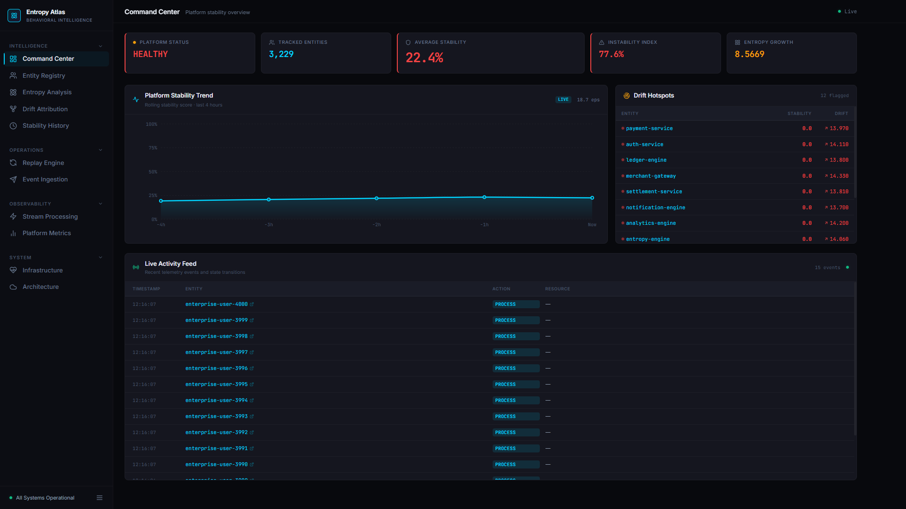
*Centralized operational intelligence showing global stability, instability indices, and live drift hotspots.*

### Entity Registry
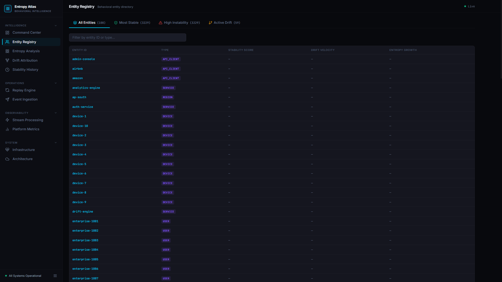
*Directory of all tracked entities with their real-time stability scores and drift velocities.*

### Entity Investigation
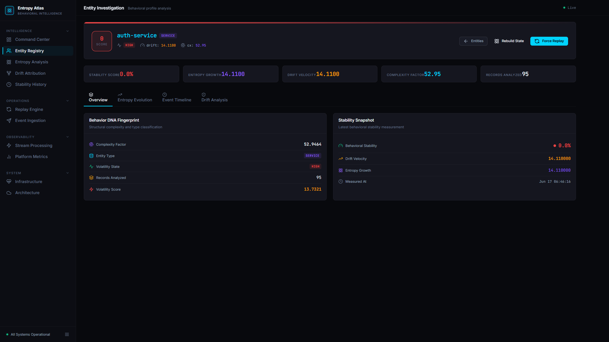
*Deep-dive profiling of a single entity, showcasing its Behavior DNA and real-time stability snapshot.*

### Behavioral Event Timeline
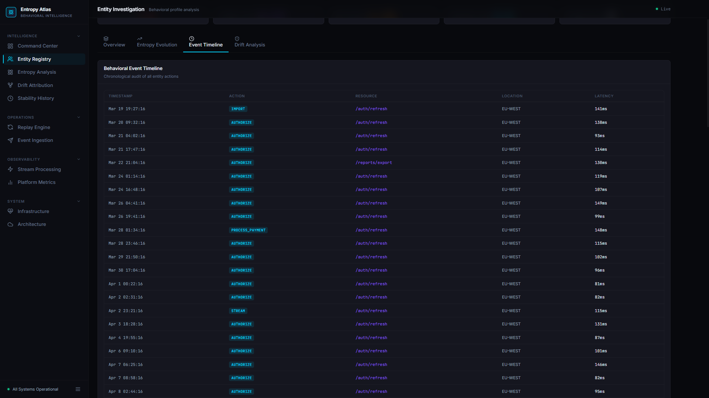
*Chronological audit log of all events driving the entity's behavioral intelligence.*

### Event Investigation
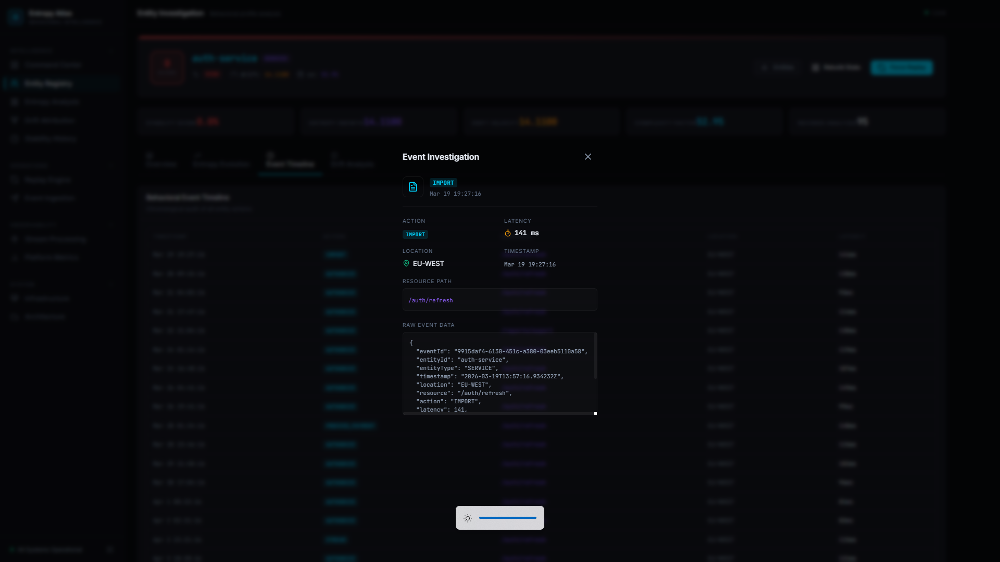
*Granular inspection of raw event payload and associated metadata.*

### Entropy Analysis
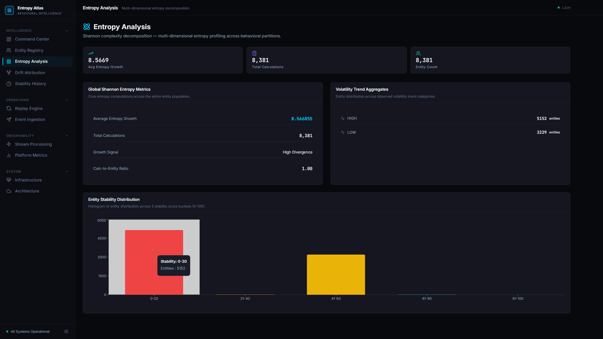
*Global distribution and decomposition of Shannon entropy metrics across the platform.*

### Entropy Evolution
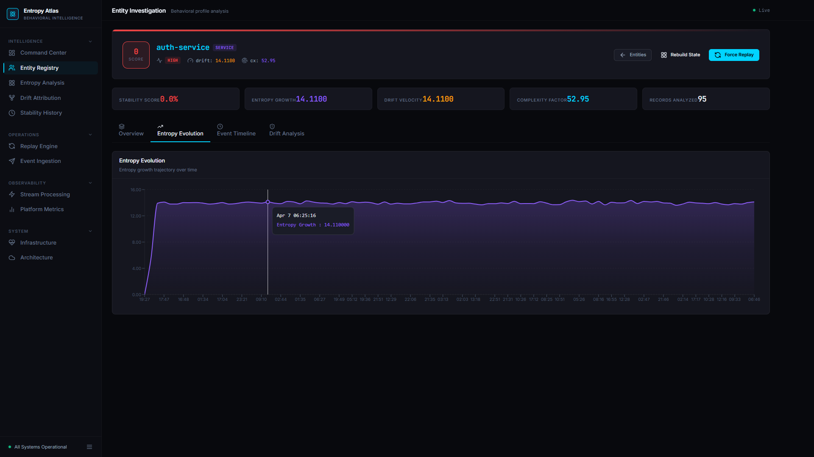
*Trajectory visualization of how an entity's entropy has grown or stabilized over time.*

### Drift Attribution Studio
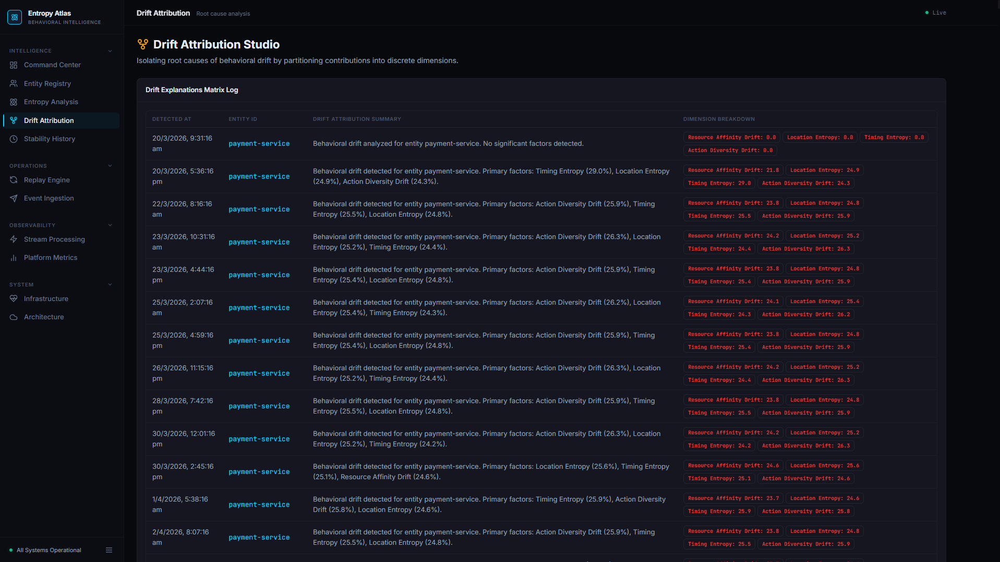
*Root-cause analysis engine partitioning drift contributions into discrete dimensions (Timing, Location, Resource, Action).*

### Active Drift Entities
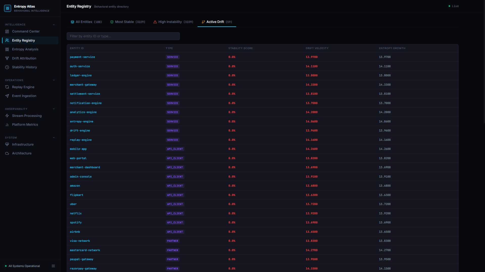
*Real-time feed of entities currently experiencing high behavioral drift.*

### Stability Timeline
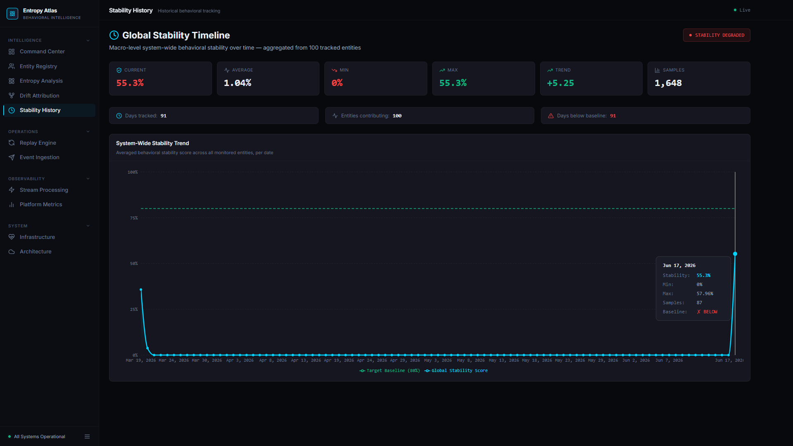
*Macro-level system-wide behavioral stability tracked over extensive time horizons.*

### Replay Intelligence Engine
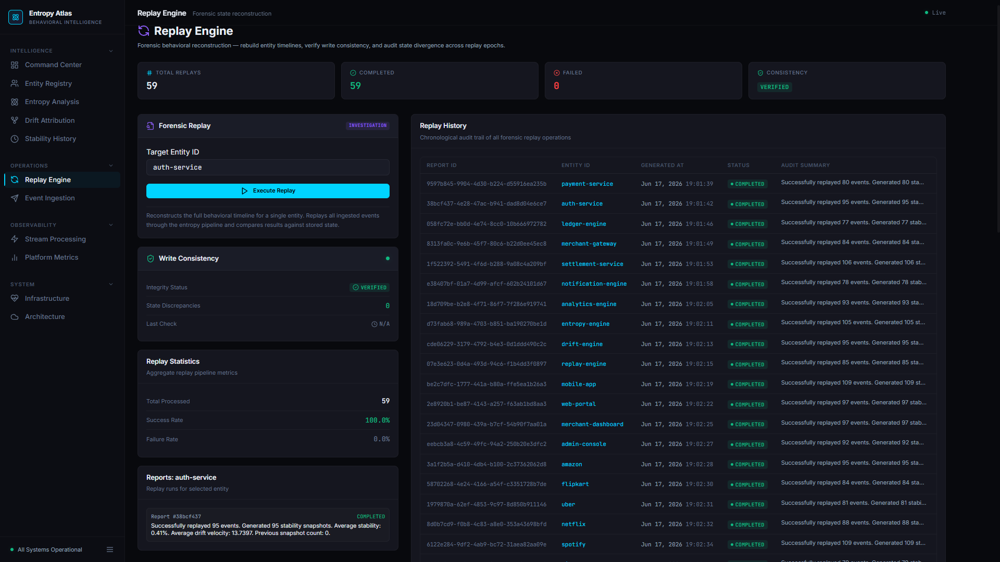
*Forensic state reconstruction interface to rebuild timelines and audit state divergence.*

### Stream Processing Intelligence
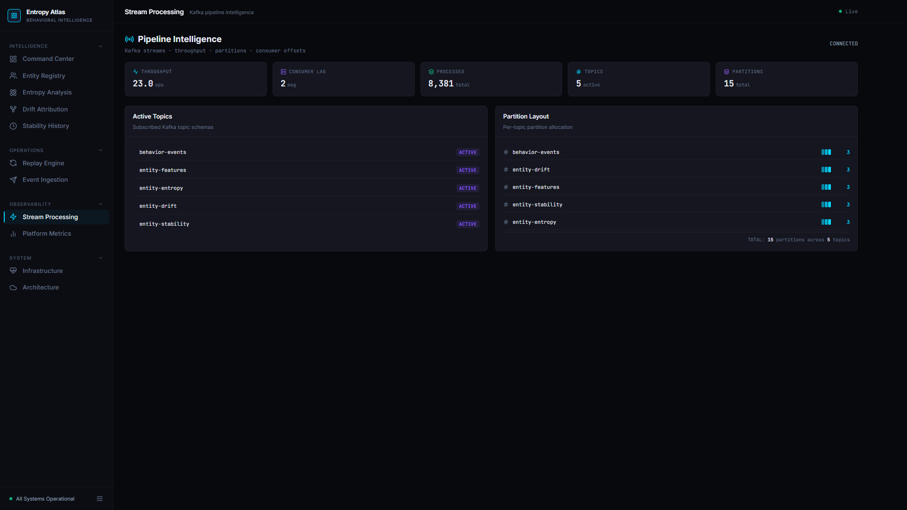
*Live telemetry from the Kafka Streams pipeline, showing throughput, lag, and partition allocation.*

### Platform Observability
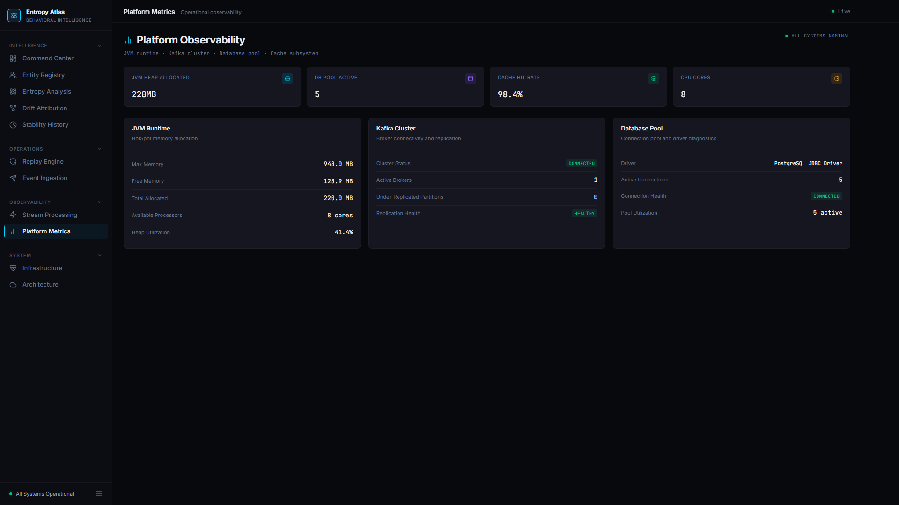
*JVM, connection pool, and core infrastructure health metrics.*

### Infrastructure Intelligence
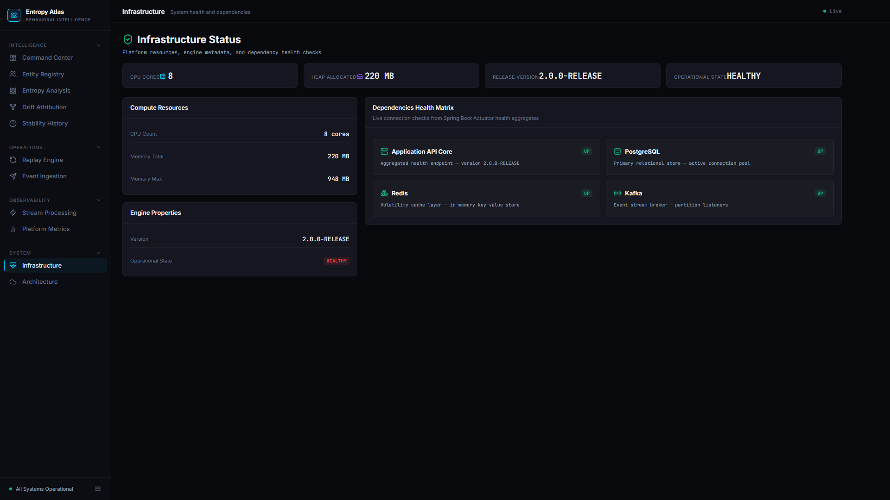
*Health matrix of all backend dependencies (Kafka, Redis, PostgreSQL).*

### System Topology
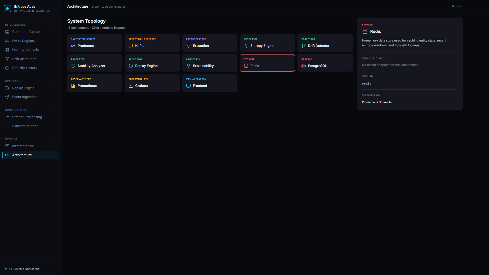
*Interactive architectural map of the Entropy Atlas components.*

### Telemetry Event Ingestion
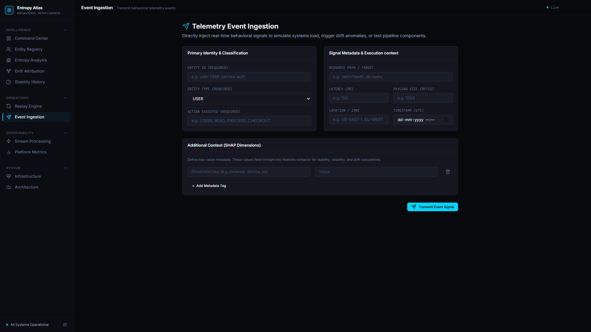
*Direct injection interface for simulating load and triggering drift anomalies.*

---

## 8. System Architecture

Entropy Atlas uses a highly decoupled, event-driven topology optimized for write-heavy streaming analytics. The original Behavioral Intelligence architecture remains the core processing foundation, while the AI Risk Manager adds a dedicated defensive payment-risk workflow on top of the existing platform.

    +-------------------+      +-------------------+      +-------------------------+
    |                   |      |                   |      |                         |
    |  Event Producers  |=====>|    Kafka Topic    |=====>|  Kafka Streams Engine   |
    |  (Microservices,  |      | [behavior-events] |      | (Behavioral Pipeline)   |
    |   API Gateways)   |      |                   |      |                         |
    +-------------------+      +-------------------+      +-------------------------+
                                                              |
                                                              v
    +-------------------------+      +-------------------+      +-------------------------+
    |                         |      |                   |      |                         |
    |   Spring Boot Backend   |<=====|    Kafka Topics   |<=====|     Core Engines:       |
    |   (REST API, Admin,     |      |  [entity-drift,   |      | - Feature Extraction    |
    |    Replay Orchestrator) |      | entity-stability] |      | - Entropy Calculation   |
    |                         |      |                   |      | - Drift Analysis        |
    +-------------------------+      +-------------------+      | - Stability Scoring     |
         |            |                                         +-------------------------+
         v            v
    +----------+ +-----------+
    |          | |           |
    | Postgres | |   Redis   |
    | (Storage)| |  (Cache)  |
    +----------+ +-----------+
         |
         v
    +-------------------------+
    |                         |
    |   React + Vite SPA      |
    |  (Mission Control UI)   |
    |                         |
    +-------------------------+

### AI Risk Manager Architecture

The AI Risk Manager extends the existing Spring Boot application with a dedicated payment-risk workflow. It does not replace the Behavioral Intelligence pipeline.

    +-------------------------+
    |   Payment Risk Event    |
    +------------+------------+
                 |
                 v
    +-------------------------+
    | Payment Risk Ingestion  |
    | POST /api/v1/risk/events|
    +------------+------------+
                 |
                 v
    +-------------------------+
    | Risk Scoring Service    |
    | Behavioral + Transaction|
    | Risk Signals            |
    +------------+------------+
                 |
                 v
    +-------------------------+
    | AI Risk Investigator    |
    | Verification + Fallback |
    +------------+------------+
                 |
                 v
    +-------------------------+
    | Risk Assessment         |
    | Score / Level / Reason  |
    +------------+------------+
                 |
        +--------+--------+
        |        |        |
        v        v        v
    +-------+ +-------+ +----------+
    |Alerts | |Invest-| | Evidence |
    |       | |igation| | & Explain|
    +---+---+ +---+---+ +----+-----+
        |         |          |
        +---------+----------+
                  |
                  v
        +-------------------+
        | Risk Decisioning  |
        +---------+---------+
                  |
                  v
        +-------------------+
        | Risk Audit Trail  |
        +---------+---------+
                  |
          +-------+-------+
          |       |       |
          v       v       v
       Evaluate Replay Simulation

### Architectural Layers

* **Behavioral Intelligence Layer:** Feature extraction, entropy calculation, drift analysis, stability scoring, volatility analysis, and behavioral fingerprinting.
* **Streaming Layer:** Kafka and Kafka Streams provide the event-driven processing foundation for behavioral intelligence.
* **Payment Risk Layer:** Payment-risk ingestion, deterministic risk scoring, AI verification, alerting, investigation, evidence, decisioning, and audit.
* **Persistence Layer:** PostgreSQL provides durable storage for events and intelligence data, while Redis provides cached access to current state.
* **Evaluation Layer:** Held-out evaluation, risk metrics, replay, and controlled scenario simulation provide mechanisms for validating the risk workflow.
* **Presentation Layer:** React + Vite provides the operational interface for both behavioral intelligence and payment-risk management.

### Risk Processing Flow

    Payment Event
          |
          v
    Risk Ingestion
          |
          v
    Behavioral + Transaction Signals
          |
          v
    Deterministic Risk Score
          |
          v
    AI Verification / Fallback
          |
          v
    Risk Assessment
          |
          +----> Alert
          |
          +----> Investigation
          |
          +----> Evidence / Explanation
          |
          v
    Defensive Decision
          |
          v
    Audit Record
          |
          +----> Evaluation
          +----> Replay
          +----> Simulation


```
---
## 8.1 Architecture Diagram

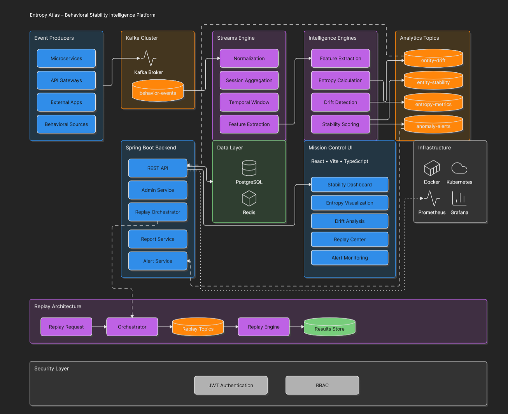

*Figure 8.1: High-level system architecture of Entropy Atlas, with the existing Behavioral Intelligence platform serving as the foundation for the integrated Payment Risk Manager workflow.*

---


## 9. Technology Stack

**Backend:**
* **Java 21:** Utilizing modern language features (Records, Virtual Threads).
* **Spring Boot 3.x:** Core application framework.
* **Kafka Streams:** Stateful stream processing topology.
* **PostgreSQL:** Persistent system of record.
* **Redis:** High-speed in-memory state store and caching layer.
* **Micrometer / Prometheus:** JVM and pipeline observability.

**Frontend:**
* **React 18:** Component-based UI.
* **Vite:** High-performance build tool.
* **Recharts:** Complex data visualization.
* **Tailwind CSS:** Utility-first styling framework.

---

## 10. Project Structure

```text
Entropy-Atlas/
│   docker-compose.yml          # Multi-container orchestration
│   README.md                   # Project documentation
│
├── backend
│   │   Dockerfile              # Spring Boot container image
│   │   pom.xml                 # Maven dependencies
│   │
│   └── src
│       └── main
│           ├── java
│           │   └── com
│           │       └── entropyatlas
│           │           └── entropyatlas
│           │               │   EntropyAtlasApplication.java
│           │               │
│           │               ├── api          # Controllers, DTOs, Filters (REST Layer)
│           │               │   ├── controllers
│           │               │   │       AdminController.java
│           │               │   │       AnalyticsController.java
│           │               │   │       DashboardController.java
│           │               │   │       EntityController.java
│           │               │   │       EntityIntelligenceController.java
│           │               │   │       EventController.java
│           │               │   │       PlatformMetricsController.java
│           │               │   │       ReplayIntelligenceController.java
│           │               │   │       StreamController.java
│           │               │   │       SystemController.java
│           │               │   │
│           │               │   ├── dto
│           │               │   │       BehaviorEventRequest.java
│           │               │   │       BehaviorEventResponse.java
│           │               │   │       DriftExplanationResponse.java
│           │               │   │       EntityResponse.java
│           │               │   │       ReplayReportResponse.java
│           │               │   │       StabilitySnapshotResponse.java
│           │               │   │
│           │               │   └── filters
│           │               │           CorrelationIdFilter.java
│           │               │
│           │               ├── config       # Kafka, Redis, OpenAPI configurations
│           │               │       KafkaConfig.java
│           │               │       OpenApiConfig.java
│           │               │       RedisConfig.java
│           │               │
│           │               ├── domain       # JPA Entities
│           │               │       BehaviorEvent.java
│           │               │       DriftExplanation.java
│           │               │       Entity.java
│           │               │       ReplayReport.java
│           │               │       StabilitySnapshot.java
│           │               │
│           │               ├── exceptions   # Global exception handling
│           │               │       ResourceNotFoundException.java
│           │               │
│           │               ├── repositories # Spring Data JPA Repositories
│           │               │       BehaviorEventRepository.java
│           │               │       DriftExplanationRepository.java
│           │               │       EntityRepository.java
│           │               │       ReplayReportRepository.java
│           │               │       StabilitySnapshotRepository.java
│           │               │
│           │               ├── services     # Core Business Logic (Engines)
│           │               │       BehavioralIntelligencePipeline.java
│           │               │       DriftAnalysisService.java
│           │               │       EntropyCalculationService.java
│           │               │       EventIngestionService.java
│           │               │       ExplainabilityService.java
│           │               │       FeatureExtractionService.java
│           │               │       MetricsService.java
│           │               │       ReplayEngineService.java
│           │               │       StabilityScoringService.java
│           │               │
│           │               ├── streams      # Kafka Streams Topology Definition
│           │               │       KafkaStreamsTopology.java
│           │               │
│           │               └── tools        # Data Generators
│           │                       EntropyAtlasDataGenerator.java
│           │
│           └── resources
│                   application.yml
│                   logback-spring.xml
│
├── frontend
│   │   Dockerfile
│   │   index.html
│   │   nginx.conf
│   │   package-lock.json
│   │   package.json
│   │   postcss.config.js
│   │   tailwind.config.js
│   │   vite.config.js
│   │
│   └── src
│       │   App.jsx
│       │   index.css
│       │   main.jsx
│       │
│       ├── api          # Axios instance and React Hooks
│       │       axiosInstance.js
│       │       hooks.js
│       │
│       ├── components   # Reusable UI components (Cards, Tables, Modals)
│       │       Button.jsx
│       │       Card.jsx
│       │       ChartContainer.jsx
│       │       Input.jsx
│       │       Layout.jsx
│       │       Modal.jsx
│       │       Pagination.jsx
│       │       Select.jsx
│       │       Table.jsx
│       │
│       ├── constants
│       │       index.js
│       │
│       ├── pages        # Route Components
│       │       Architecture.jsx
│       │       Dashboard.jsx
│       │       DriftAttribution.jsx
│       │       Entities.jsx
│       │       EntityProfile.jsx
│       │       EntropyExplorer.jsx
│       │       EventIngestion.jsx
│       │       MetricsCenter.jsx
│       │       ReplayCenter.jsx
│       │       StabilityTimeline.jsx
│       │       StreamAnalytics.jsx
│       │       SystemHealth.jsx
│       │
│       └── utils        # Helper functions
│               index.js
│
├── grafana
│   └── provisioning
│       ├── dashboards
│       │       dashboard.yml
│       │       entropy-atlas-dashboard.json
│       │
│       └── datasources
│               datasource.yml
│
├── images
│       active-drift-entity.png
│       behavioral-entity-directory.png
│       behavioral-event-timeline.png
│       behavioral-profile-analysis.png
│       drift-analysis.png
│       drift-attribution-studio.png
│       entropy-growth-trajectory.png
│       event-investigation.png
│       global-stability-timeline.png
│       infrastructure.png
│       multi-dimensional-entropy-decomposition.png
│       platform-metrics.png
│       platform-stability-overview.png
│       replay-engine.png
│       stream-processing.png
│       system-topology.png
│       telemetry-event-ingestion.png
│
└── prometheus
        prometheus.yml
```

---

## 11. Domain Model

* **`Entity`**: The root aggregate representing an actor (e.g., `payment-service`, `user-123`).
* **`BehaviorEvent`**: An immutable, atomic record of an action performed by an entity (e.g., `LOGIN`, `PROCESS_PAYMENT`).
* **`StabilitySnapshot`**: A point-in-time materialization of an entity's behavioral stability metrics.
* **`DriftExplanation`**: A detailed breakdown of the dimensional contributions that caused a drift event.
* **`ReplayReport`**: An audit record of a forensic timeline reconstruction.

---

## 12. Database Design

* **`entities`**: Stores entity metadata, type, and creation timestamps.
* **`behavior_events`**: Append-only log of all ingested telemetry and payment-risk events. Optimized with indexes on `entity_id` and `timestamp`.
* **`stability_snapshots`**: Timeseries table capturing `stability_score`, `entropy_growth`, and `drift_velocity`.
* **`drift_explanations`**: Stores the root cause analysis summaries.
* **`drift_explanation_contributions`**: Normalized child table mapping explanations to specific dimensional percentages (e.g., Timing: 45%).
* **`replay_reports`**: Stores metadata regarding admin-triggered historical replays.
* **Risk assessment data**: Stores payment-risk assessments, including risk scores, risk levels, AI verification results, recommended decisions, and associated explanations.
* **Risk evidence and audit data**: Persists evidence associated with risk incidents together with investigation, decision, and audit records, providing traceability across the risk workflow.
* **Risk evaluation data**: Stores evaluation results used to measure the performance of the payment-risk detection workflow against labeled evaluation data.
---

### 13. Behavioral Event Lifecycle

```text
[1. INGESTION] -> [2. STORAGE] -> [3. KAFKA] -> [4. STREAM PROCESSING] -> [5. MATERIALIZATION]

1. Client POSTs to /api/v1/events
2. EventIngestionService saves the raw event to PostgreSQL (behavior_events).
3. EventIngestionService publishes the event to Kafka topic 'behavior-events'.
4. Kafka Streams consumes the event and runs it through the Behavioral Intelligence Pipeline.
5. The pipeline emits the resulting stability state to the 'entity-stability' topic.
6. Spring consumes the stability output, saves it as a StabilitySnapshot, and updates the Redis cache.
---

### 14. Behavioral Intelligence Pipeline

The pipeline is a sequential chain of deterministic engines implemented via `BehavioralIntelligencePipeline` service and orchestrated by Kafka Streams.

**Why it exists:** To transform raw, meaningless telemetry into structured mathematical models of behavior.

**Where it appears in UI:** Powers the entirety of the platform, specifically the Entity Profile and Command Center.

The same behavioral intelligence foundation is also used by the Payment Risk Manager to provide behavioral context for payment-risk assessment. This allows payment events to be evaluated using signals derived from observed entity behavior rather than relying exclusively on isolated transaction attributes.

---

### 15. Entropy Engine

**Why it exists:** To mathematically quantify the chaos or unpredictability of an entity's actions.

**How it works:** Implemented in `EntropyCalculationService`. It uses deterministic approximations of Shannon complexity across four vectors:

1. **Timing Entropy:** Based on the hour of day and day of week.
2. **Location Entropy:** Derived from the geographic or network location hash.
3. **Resource Entropy:** Derived from the API or database resource accessed.
4. **Action Entropy:** Derived from the type of operation (e.g., read, write).

These are smoothed using an Exponential Moving Average (EMA) ($\alpha = 0.15$) against historical state.

For payment-risk analysis, behavioral instability derived from these signals can contribute to the broader risk assessment, providing behavioral context alongside transaction-level risk signals.

---

### 16. Stability Engine

**Why it exists:** Raw entropy is difficult to interpret. We need a normalized 0-100 metric for operational dashboards.

**How it works:** Implemented in `StabilityScoringService`. It aggregates the multi-dimensional entropy scores and current drift velocity. Higher entropy and higher drift result in a lower stability score.

* Stability Score = 100 - Instability Index.

**Where it appears in UI:** Command Center hero metric, Entity Registry table.

The resulting behavioral stability state also serves as one of the signals available to the Payment Risk Manager when evaluating behavioral instability associated with payment activity.

---

### 17. Drift Attribution Engine

**Why it exists:** When stability drops, engineers need to know *why* without digging through logs.

**How it works:** Implemented in `DriftAnalysisService`. It calculates the absolute delta between current entropy dimensions and the previous baseline (drift velocity). The `generateDriftExplanation` method creates a normalized percentage breakdown (e.g., "Timing Entropy contributed 60% to this drift").

**Where it appears in UI:** Drift Attribution Studio.

The same attribution model provides useful behavioral evidence for payment-risk investigation, helping distinguish which behavioral dimensions contributed to a change in an entity's observed behavior.

---

### 18. Volatility Engine

**Why it exists:** To categorize the rate of change into human-readable states for alerting and triage.

**How it works:** Analyzes the magnitude and trajectory of the drift velocity. Classifies the entity as `STABLE`, `ELEVATED`, or `HIGH` volatility.

**Where it appears in UI:** Entity Investigation header badges.

For payment-risk operations, volatility provides additional behavioral context when investigating whether an entity's activity is becoming increasingly unstable.

---

### 19. Behavior DNA Engine

**Why it exists:** To fingerprint the structural complexity of an entity.

**How it works:** Aggregates long-term stability baselines, average entropy, and standard deviation of drift into a single "Complexity Factor".

**Where it appears in UI:** Entity Investigation > Overview Tab (Behavior DNA Fingerprint card).

The Behavior DNA representation also provides a compact view of an entity's longer-term behavioral characteristics that can be used as investigation context within the broader risk workflow.

---

### 20. Replay Intelligence Engine

**Why it exists:** For forensic auditing. If an algorithm changes or state is lost, the platform must deterministically rebuild the intelligence from raw events.

**How it works:** Implemented in `ReplayEngineService`. It loads all historical `BehaviorEvent`s from Postgres for a specific entity, sorts them by timestamp, and forces them synchronously through the `BehavioralIntelligencePipeline`. It then compares the resulting final state against the current stored state to verify consistency.

**Where it appears in UI:** Replay Engine module.

    [Admin Request] -> Fetch All Entity Events -> Replay via Pipeline -> Generate Stability Snapshots -> Compare & Save ReplayReport

The risk workflow extends this replay capability to payment-risk analysis, allowing historical entity activity to be reconstructed and examined as part of risk validation and investigation.

---

### 21. Kafka Streams Processing Pipeline

**Why it exists:** To provide scalable, fault-tolerant, stateful stream processing.

**How it works:** Defined in `KafkaStreamsTopology.java`.

* Subscribes to `behavior-events`.
* Uses `KStream.mapValues` to pass events to the Feature Extractor -> Entropy Engine -> Drift Engine -> Stability Engine.
* Branches the stream into `entity-drift` and `entity-stability` output topics based on calculated metrics.

The Payment Risk Manager operates alongside this behavioral intelligence pipeline through the application's risk services and APIs, using the resulting behavioral context as part of payment-risk assessment rather than replacing the existing Kafka Streams architecture.

---

### 22. Observability Architecture

**Why it exists:** The intelligence platform itself must be observable to guarantee accuracy.

**How it works:**

* Spring Boot Actuator exposes `/actuator/prometheus`.
* `MetricsService` registers custom Micrometer counters (`events_ingested_total`, `entropy_calculations_total`, `drift_detections_total`).
* Grafana consumes Prometheus data to visualize JVM heap, Kafka consumer lag, and database connection pools.

The risk workflow also exposes dedicated evaluation and risk metrics through the application APIs, allowing payment-risk detection performance and operational outcomes to be inspected alongside the platform's infrastructure metrics.

---

### 23. Frontend Platform Overview

The frontend is a React + Vite Single Page Application (SPA). It uses a dark, futuristic design language to convey deep operational intelligence. It relies heavily on `react-router-dom` for navigation, `recharts` for complex SVG data visualizations, and customized Tailwind CSS for layout density and typography.

The frontend now includes dedicated interfaces for the Payment Risk Manager in addition to the original behavioral intelligence modules. These include risk command-center views, risk evaluation, scenario simulation, investigation, audit, and related payment-risk workflows.

The frontend therefore exposes both sides of the platform:

* **Behavioral Intelligence:** Entity profiles, entropy exploration, drift attribution, stability timelines, replay, and stream analytics.
* **Payment Risk Management:** Risk monitoring, alerts, investigation, evidence, decisioning, audit history, evaluation, and controlled risk simulation.
---

## 24. Dashboard Modules

* **Architecture:** Renders an interactive D3/SVG-style node graph of the system components.
* **Entities:** A robust data grid for filtering and sorting the entity registry.
* **EntropyExplorer:** Advanced multi-dimensional visualization of entropy evolution.
* **EventIngestion:** A developer tool to manually POST telemetry payloads.
* **MetricsCenter:** Real-time polling of backend Actuator and Micrometer metrics.
* **RiskCommandCenter:** Centralized view of payment-risk alerts, risk assessments, and operational risk indicators.
* **RiskEvaluation:** Displays payment-risk detection evaluation results and classification metrics.
* **Risk Investigation:** Provides incident-level investigation, supporting evidence, and risk explanations.
* **Risk Audit:** Provides visibility into the recorded audit trail of risk events, investigations, and decisions.
* **Risk Simulator:** Provides controlled payment-risk scenario simulation for validating risk behavior.
* **Replay Intelligence:** Supports historical reconstruction and analysis of entity behavior and payment-risk activity.

---

## 25. API Reference

The backend exposes a comprehensive REST surface covering behavioral intelligence, platform observability, replay operations, and defensive payment-risk management.

### Admin

* `GET /admin/drift-report/{entityId}`: Retrieves deep diagnostic drift reports.
* `POST /admin/rebuild/{entityId}`: Triggers asynchronous state rebuild.
* `GET /admin/replay-reports/{entityId}`: Fetches forensic replay history.
* `POST /admin/replay/{entityId}`: Executes a deterministic replay sequence.

### Analytics

* `GET /api/v1/analytics/distribution`: Global stability score distribution.
* `GET /api/v1/analytics/drift`: Platform-wide drift statistics.
* `GET /api/v1/analytics/entropy`: Aggregated Shannon entropy metrics.
* `GET /api/v1/analytics/trends`: Macro volatility trends.
* `GET /api/v1/analytics/volatility`: Aggregate volatility categories.

### Dashboard

* `GET /api/v1/dashboard/activity`: Live feed of recent behavior events.
* `GET /api/v1/dashboard/health`: High-level system health overview.
* `GET /api/v1/dashboard/overview`: Core command center KPIs.

### Entity Management

* `GET /api/v1/entities`: Paginated registry list.
* `GET /api/v1/entities/{id}`: Core profile lookup.
* `GET /api/v1/entities/{id}/explanations`: Dimensional drift summaries.
* `GET /api/v1/entities/{id}/stability`: Timeseries stability data.
* `GET /api/v1/entities/{id}/timeline`: Chronological event audit log.

### Entity Intelligence

* `GET /api/v1/entities/{id}/behavior-dna`: Complexity fingerprinting.
* `GET /api/v1/entities/{id}/entropy-evolution`: Multi-dimensional entropy timeseries.
* `GET /api/v1/entities/{id}/volatility`: Current volatility classification.
* `GET /api/v1/entities/high-drift`: Entities exceeding drift thresholds.
* `GET /api/v1/entities/top-stable`: Entities with lowest entropy.
* `GET /api/v1/entities/top-unstable`: Entities with highest chaos indices.

### Event Ingestion

* `POST /api/v1/events`: Fire-and-forget telemetry ingestion endpoint.

### Payment Risk Management

* `POST /api/v1/risk/events`: Ingests a payment-risk event and initiates risk assessment.
* `GET /api/v1/risk/alerts`: Retrieves payment-risk alerts.
* `GET /api/v1/risk/incidents/{incidentId}`: Retrieves details for a specific risk incident.
* `POST /api/v1/risk/incidents/{incidentId}/investigate`: Initiates investigation of a risk incident.
* `GET /api/v1/risk/incidents/{incidentId}/evidence`: Retrieves evidence associated with a risk incident.
* `POST /api/v1/risk/incidents/{incidentId}/decision`: Submits a defensive risk decision for an incident.
* `GET /api/v1/risk/incidents/{incidentId}/audit`: Retrieves the audit history for a risk incident.
* `GET /api/v1/risk/decisions`: Retrieves recorded risk decisions.
* `GET /api/v1/risk/audit`: Retrieves risk audit records.
* `POST /api/v1/risk/replay/{entityId}`: Executes payment-risk replay for an entity.
* `GET /api/v1/risk/metrics`: Retrieves payment-risk evaluation and operational metrics.
* `POST /api/v1/risk/simulation`: Runs a controlled payment-risk scenario simulation.

### Risk Scenario

* `POST /api/scenario/start`: Starts a payment-risk scenario through the scenario simulation workflow.

### Platform Metrics

* `GET /api/v1/metrics/cache`: Redis hit rates and utilization.
* `GET /api/v1/metrics/database`: Postgres connection pool states.
* `GET /api/v1/metrics/jvm`: Heap, threads, and GC metrics.
* `GET /api/v1/metrics/kafka`: Consumer lag and partition health.
* `GET /api/v1/metrics/summary`: Consolidated infrastructure health.

### Replay Intelligence

* `GET /api/v1/replay/consistency`: Verification results of stored vs. calculated state.
* `GET /api/v1/replay/history`: Log of all historical replay operations.
* `GET /api/v1/replay/statistics`: Success/Failure rates of replay engine.

### Streams

* `GET /api/v1/streams/lag`: Consumer group lag metrics.
* `GET /api/v1/streams/partitions`: Topic partition allocation mapping.
* `GET /api/v1/streams/throughput`: Processing velocity (msg/sec).
* `GET /api/v1/streams/topics`: Active Kafka topic metadata.

### System

* `GET /api/v1/system/dependencies`: Health checks for downstream dependencies.
* `GET /api/v1/system/health`: Global operational state.
* `GET /api/v1/system/resources`: CPU and memory utilization.
* `GET /api/v1/system/status`: Application release and uptime data.
---


## 27. Swagger Validation Guide

The OpenAPI specification is available at `http://localhost:8080/swagger-ui.html`.

Engineers can bypass the UI and validate the API contracts directly using Swagger.

* Test `POST /api/v1/events` to ensure validation rules (e.g., missing `entityId`) throw `400 Bad Request`.
* Test `GET /api/v1/entities/{id}/behavior-dna` to verify the mathematical shape of the JSON response.
* Test `POST /api/v1/risk/events` with a valid payment-risk payload to verify risk ingestion and assessment.
* Test `GET /api/v1/risk/alerts` to verify that risk alerts are returned correctly.
* Test `GET /api/v1/risk/incidents/{incidentId}` to inspect an individual risk incident.
* Test `POST /api/v1/risk/incidents/{incidentId}/investigate` and `GET /api/v1/risk/incidents/{incidentId}/evidence` to validate the investigation and evidence workflow.
* Test `POST /api/v1/risk/incidents/{incidentId}/decision` to validate explicit risk decision submission.
* Test `GET /api/v1/risk/audit` and `GET /api/v1/risk/incidents/{incidentId}/audit` to verify audit records.
* Test `GET /api/v1/risk/metrics` to inspect available risk evaluation metrics.
* Test `POST /api/v1/risk/simulation` to validate controlled payment-risk scenario simulation.

---

## 28. Platform Metrics Guide

Validation of backend health:

1. Open Grafana (`http://localhost:3001`).
2. View the pre-provisioned "Entropy Atlas Backend Overview" dashboard.
3. Run a load test script pushing 100 events/second.
4. Verify `events_ingested_total` rises linearly and `entropy_calculations_total` matches exactly.
5. Verify JVM heap does not exhibit rapid saw-tooth patterns indicative of memory leaks in the stream processors.
6. Inspect the payment-risk metrics endpoint (`GET /api/v1/risk/metrics`) to verify that risk evaluation results and operational metrics are being exposed.
7. Compare risk evaluation results against the labeled evaluation data used by the risk evaluation workflow rather than relying only on aggregate infrastructure metrics.

---

## 29. Replay Validation Guide

To validate the deterministic nature of the intelligence pipeline:

1. Identify a highly volatile entity in the UI.
2. Navigate to the **Replay Engine**.
3. Execute a replay for that entity ID.
4. The system will process all historical events synchronously.
5. Ensure the resulting `ReplayReport` shows a status of `COMPLETED` and `Write Consistency` is marked as `VERIFIED`.

The Payment Risk Manager also exposes a risk replay operation through `POST /api/v1/risk/replay/{entityId}`. This can be used to reconstruct historical entity activity in the context of payment-risk analysis and validate the resulting risk workflow behavior.

---

## 30. Operational Workflow

For engineers operating Entropy Atlas in a controlled environment:

* **Cold Start:** Kafka topics are automatically created on startup via Spring Kafka configuration.
* **Monitoring:** Alarms should be set on Kafka consumer lag (`/api/v1/streams/lag`). If lag increases exponentially, the Kafka Streams instances require horizontal scaling.
* **Data Retention:** `behavior_events` will grow unbounded. Implement table partitioning in PostgreSQL based on the `timestamp` column.
* **Risk Monitoring:** Monitor the risk alert, investigation, decision, and audit workflows through the dedicated risk APIs and UI modules.
* **Risk Evaluation:** Review precision, recall, false-positive/false-negative behavior, and associated evaluation results before changing risk policies or thresholds.
* **Risk Simulation:** Use controlled scenario simulation and replay to validate risk behavior before relying on changes in a live event stream.
* **Auditability:** Preserve risk investigation and decision records so that defensive actions can be traced back to the corresponding risk assessment and evidence.

---
## 31. Scalability Considerations

* **Stream Processing:** Kafka Streams instances can be scaled horizontally by deploying more backend containers. Kafka handles partition reassignment automatically. Max concurrency is limited by the number of partitions on the `behavior-events` topic.
* **Database:** The `behavior_events` table handles massive insert velocity. In highly-scaled environments, this should be transitioned to a columnar datastore (e.g., ClickHouse) or partitioned deeply.
* **Cache:** Redis prevents massive query loads on PostgreSQL for current stability state. Ensure Redis is provisioned with sufficient memory and eviction policies (e.g., `allkeys-lru`).
* **Risk Processing:** Payment-risk evaluation is exposed through dedicated risk services and APIs. At larger scale, risk ingestion, investigation, evaluation, and other risk workloads can be separated into independently scalable services while retaining the existing behavioral intelligence foundation.
* **Evaluation Workloads:** Risk evaluation, replay, and simulation workloads can be isolated from the primary event-processing path so that analytical operations do not unnecessarily compete with real-time ingestion resources.

---

## 32. Engineering Tradeoffs

* **Eventual Consistency vs. Real-Time UI:** The REST API reads from PostgreSQL/Redis, which are updated *after* Kafka Streams processing. There is a sub-second delay between event ingestion and metric updates. This is a tradeoff made for massive write throughput.
* **Deterministic Math vs. Machine Learning:** The behavioral intelligence layer utilizes deterministic Shannon entropy models rather than deep learning. While less capable of finding complex hidden correlations, the resulting calculations are explicitly inspectable, require no model-training lifecycle, and use comparatively low compute resources.
* **Deterministic Risk Scoring vs. Model Complexity:** The current payment-risk scoring layer uses explicit, weighted behavioral and transaction-level signals rather than a trained fraud-classification model. This makes the contributing factors straightforward to inspect and tune, while limiting the system's ability to automatically learn complex nonlinear fraud patterns.
* **AI Verification vs. Operational Reliability:** AI verification is used as an additional verification layer rather than the sole source of truth. A controlled fallback path allows the risk workflow to continue when AI verification is unavailable or cannot provide a usable result.
* **Monolithic Repository:** The backend currently houses both the REST API and the Kafka Streams topology in a single Spring Boot application. At massive scale, the streams topology should be extracted into a dedicated microservice.

---

## 33. Engineering Concepts Demonstrated

* **Event-Driven Architecture:** Behavioral and payment-risk events enter the platform through API-driven ingestion workflows and are persisted for downstream intelligence and analysis.
* **Event Sourcing & CQRS:** State is derived from an immutable behavioral event history where replayable state reconstruction is required.
* **Real-Time Stream Processing:** Utilizing Kafka Streams for complex event topology and stateful behavioral processing.
* **Deterministic Algorithms:** Using mathematically explainable entropy, stability, drift, and volatility calculations rather than relying exclusively on black-box models.
* **Defensive AI Risk Management:** Combining deterministic risk signals with AI verification, controlled fallback, investigation, evidence, decisioning, and auditability.
* **Risk Evaluation:** Measuring detection behavior using held-out evaluation data and classification metrics rather than relying solely on qualitative demonstrations.
* **Forensic Replay:** Reconstructing historical behavior from stored events to validate consistency and investigate risk scenarios.
* **High-Density Operational UI:** Moving beyond standard charting to create deep, interactive investigation workspaces for behavioral intelligence and payment-risk operations.

---

## 34. Future Improvements

* **ClickHouse Integration:** Migrate raw event storage from PostgreSQL to ClickHouse for superior timeseries aggregation performance.
* **Dynamic Baselining:** Allow the EMA $\alpha$ coefficient to self-tune based on entity lifecycle phase.
* **WebSockets/SSE:** Push stability updates directly to the frontend to eliminate client-side polling.
* **Topology Extraction:** Separate the REST API, Ingestion, and Streams Processing into isolated deployable units.
* **Learned Risk Models:** Evaluate trained fraud-risk models against the current deterministic scoring layer using the same held-out evaluation framework, with explicit measurement of precision, recall, false-positive cost, and false-negative cost.
* **Adaptive Risk Policies:** Introduce data-driven policy calibration while retaining explicit decision boundaries and auditability.
* **Expanded Risk Signals:** Incorporate additional behavioral and transaction-level signals as the evaluation dataset and risk scenarios evolve.
* **Production-Grade Risk Controls:** Add stronger policy governance, model/version tracking, configurable approval controls, and operational safeguards before deploying the risk workflow in a production payment environment.

---

## 35. License

Copyright © 2026. All rights reserved.
Internal Platform Engineering Documentation. Not for external distribution.
